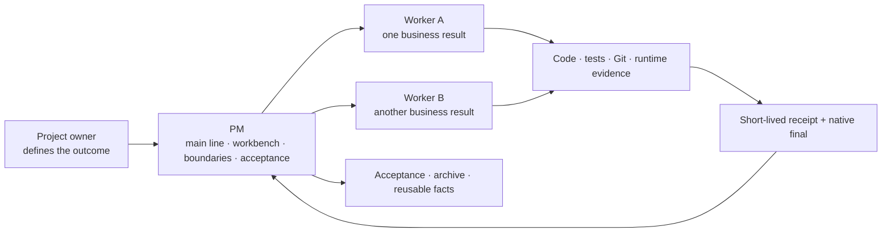

# BEYOND

**English** | [简体中文](README.zh-CN.md)


> **Beyond Chat. Build Reality.**
> Help Codex finish real project outcomes instead of stopping at answers.

BEYOND is an open-source AI engineering collaboration system for **local Codex Desktop projects**. One PM governs the main line and acceptance, each Worker continuously owns one business result, and durable project facts, authorization boundaries, current evidence, and task state return to recoverable project-owned sources.

It is built for people already using Codex on real repositories who are tired of repeated context loss, finished Workers that never return to the PM, stage-heavy workflows that require constant “continue” prompts, ambiguous claims such as “tests passed” versus “released,” and conflicting writes across parallel tasks.

[Download BEYOND v3.2.4](https://github.com/adubeyond/beyond-ai-collaboration/releases/tag/v3.2.4) · [Gitee mirror](https://gitee.com/adubeyond/beyond-ai-collaboration) · [90-second real case](docs/en/real-case-and-90-second-demo.md) · [Installation](模板交付包/docs/en/installation-upgrade-and-project-initialization.md) · [Quick Start](docs/en/quick-start.md) · [3.2.4 Upgrade Guide](docs/en/releases/v3.2.4.md) · [Architecture](docs/en/architecture.md)

## What BEYOND changes

| Real problem | BEYOND behavior |
| --- | --- |
| A new task does not know the project's current line | Objectives, the workbench, and reusable facts live in a project-local control repository |
| The PM has to wait, poll, and chase finished Workers | A Worker saves a short-lived receipt and calls the PM back on completion or genuine pause |
| Design, development, testing, and operations become manual handoffs | One Worker continuously owns the result and switches methods as needed |
| Short prompts get trapped behind framework defaults | Current explicit instructions override ordinary BEYOND preferences; clear goals execute directly and only material ambiguity triggers a question |
| “Tests passed,” “may commit,” and “may release” collapse into one permission | Files, Git, network, servers, data, and production remain separate evidence and authorization domains |
| Parallel tasks overwrite one another or close twice | The PM registers one owner and write boundary per result; acceptance and archival are idempotent |

## Core capabilities in 3.2.4

- **Same-turn multi-result dispatch:** when one explicit instruction approves several independent results, the PM creates and registers each without waiting for or polling Workers between them.
- **Control-root isolation:** terminal runtime resolution stays with the current project-root mapping; an unregistered project ID is rejected before pending data can be written.
- **Bounded terminal recovery:** native callbacks remain primary; if the host omits a runnable closeout turn, the next natural PM turn performs one bounded pending read for active tasks.
- **Lightweight installation:** non-Git projects are valid targets, and Windows backups compare the same hidden-aware path, byte, and hash inventory on both sides.
- **Goal-first execution:** the user's current objective, boundary, and authorization take priority over ordinary BEYOND preferences and stale habits.
- **Meaningful clarification only:** investigate facts available in code, configuration, Git, tests, and environments; ask the user only when the answer changes the business result.
- **One result, one Worker:** the PM manages the portfolio while one Worker continuously owns and delivers each business result.
- **Continuous task execution:** design, development, testing, and operations are methods selected inside one task, not four agents waiting on one another.
- **Evidence-based conclusions:** generated code is not proof of testing, and passing tests are not proof of commit, release, deployment, or production usability.
- **Reliable terminal return:** a Worker stores a short-lived receipt matching its formal final before the callback; the PM removes it after the workbench transaction succeeds.
- **CLI-first, instruction-aware:** use a CLI when capabilities are equivalent; use a browser when the user requests it or the task depends on an existing signed-in session, extension, or visible UI state.
- **Real authorization boundaries:** current authorization may override an execution preference, but it does not silently expand into credentials, production, shared data, or destructive operations.

## How it works



The PM does not become the developer and does not continuously poll Workers for control. After all business actions finish, a Worker freezes its final, stores one short-lived receipt, performs one lightweight callback as its last tool call, and ends. The awakened PM scans registered tasks and pending receipts, verifies the evidence, and closes the result idempotently.

## Start in three steps

### 1. Download the official release

- [BEYOND-3.2.4.zip](https://github.com/adubeyond/beyond-ai-collaboration/releases/download/v3.2.4/BEYOND-3.2.4.zip)
- [BEYOND-3.2.4.zip.sha256](https://github.com/adubeyond/beyond-ai-collaboration/releases/download/v3.2.4/BEYOND-3.2.4.zip.sha256)

Verify the checksum file before extraction. See the [Installation, Upgrade, and Project Initialization Guide](模板交付包/docs/en/installation-upgrade-and-project-initialization.md) for exact commands.

### 2. Let Codex install it

Open a new ordinary Codex task in the target project and send this prompt without invoking an identity Skill:

```text
This is BEYOND installation maintenance. Do not create a PM, Worker, or business task.
Use the verified official BEYOND 3.2.4 package I downloaded to install or upgrade this project's beyond-control directory and six global Skills.
Create a precise backup first. Preserve native project rules and real content under local, projects, and shared; never replace them with empty templates.
Fuse the project entry, run installation verification, then stop and wait for me to restart Codex. Do not start, resume, or modify business tasks.
```

Installation adds the project-local `beyond-control/`, fuses the root `AGENTS.md`, and installs six user-level Skills:

```text
identity-pm      identity-worker
task-design      task-dev
task-test        task-ops
```

BEYOND 3.2.4 does not install an identity Hook, notify branch, daemon, or extra Codex CLI.

### 3. Restart and adopt the project

Restart Codex after replacing global Skills. Open a new task at the project root:

```text
$identity-pm
Use BEYOND to initialize this new project.
```

For an existing project:

```text
$identity-pm
Use BEYOND to adopt or upgrade this existing project.
```

After minimum adoption, either complete initialization now or begin work and fill remaining fact groups on demand. BEYOND does not force an empty project to invent servers, deployment paths, or business facts.

## A real task example

```text
$identity-pm

Outcome: add batch export to the order module and prove that the generated file downloads in the test environment.
Non-goals: do not modify production data and do not deploy to production.
Acceptance: existing tests pass, a new export test passes, and one real download is verified in the test environment.
Authorization: code changes, tests, one local commit, and test-environment deployment are allowed; push and production release are not.

Register one formal task and let one Worker continuously perform the required design, development, testing, and test-environment verification.
```

When the result is clear, the PM dispatches it directly. The Worker does not split design, development, and testing into separate outcomes that require repeated “continue” prompts. Ordinary failures are repaired and retested in the same task; a genuine business decision or high-risk permission gap causes a real pause.

## Who it is for

BEYOND is a good fit for:

- solo developers, one-person companies, and small teams maintaining real projects with Codex;
- several concurrent feature, defect, data, operations, or release tasks;
- projects that need durable memory, recovery, permission separation, and evidence-based acceptance;
- users who want less process and less manual prompting without weakening production boundaries.

It is not currently a good fit for:

- one-off questions, copywriting, or simple requests with no project state;
- platforms without project tasks, Skills, or thread callbacks;
- autonomous production changes without an explicit target, authorization, verification, and rollback boundary.

## Current boundaries

- The current stable release is `v3.2.4`, primarily for local Codex Desktop projects.
- Standard installation and operation have been validated in real Windows projects; public checks also cover package contents, installation structure, and the minimal fixture.
- Task creation, callbacks, and persistent permissions vary across platforms. Evidence from one platform is not a universal compatibility claim.
- BEYOND collects no installation telemetry. GitHub Release download counts measure release-asset downloads only, not every installation or active user.

## Documentation

| Goal | Start here |
| --- | --- |
| See a real completion and pause/resume path | [Real case and 90-second demo](docs/en/real-case-and-90-second-demo.md) |
| Install, upgrade, or roll back | [Installation, Upgrade, and Project Initialization](模板交付包/docs/en/installation-upgrade-and-project-initialization.md) |
| Try a clean fixture | [Quick Start](docs/en/quick-start.md) |
| Understand PM, Worker, documents, and runtime | [Architecture](docs/en/architecture.md) |
| Review 3.2.4 changes | [Upgrade Guide](docs/en/releases/v3.2.4.md) · [CHANGELOG](CHANGELOG.md) |
| Inspect the control repository | [Template Package](模板交付包/README.md) |
| Report a problem or propose an improvement | [Issues](https://github.com/adubeyond/beyond-ai-collaboration/issues) · [Contributing](CONTRIBUTING.en.md) |
| Report a vulnerability privately | [Security Policy](SECURITY.en.md) |

## Open source

BEYOND is licensed under the [Apache License 2.0](LICENSE). Issues and Pull Requests pass public checks and human review; passing tests does not guarantee acceptance.

Created and maintained by [adubeyond](https://github.com/adubeyond).

`adubeyond · Creator of BEYOND`

> **Beyond Chat. Build Reality.**
