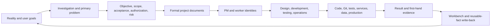
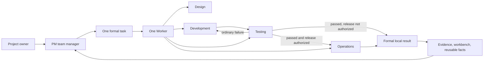

# BEYOND 3.2

**English** | [简体中文](README.zh-CN.md)


> **Beyond Chat. Build Reality.**

BEYOND is a document-driven AI engineering collaboration system for Codex. It turns goals, governance, execution, verification, and project knowledge into one continuous engineering loop instead of treating an AI response—or generated code—as completion.

Most AI coding tools focus on generating code faster. BEYOND focuses on a harder problem: helping AI understand a real project, stay within authorization, finish a complete business task, prove the result, and become more effective as project knowledge grows.

[Installation and Project Initialization](模板交付包/docs/en/installation-upgrade-and-project-initialization.md) · [Quick Start](docs/en/quick-start.md) · [v3.2.1 Upgrade Guide](docs/en/releases/v3.2.1.md) · [Architecture](docs/en/architecture.md) · [Control Repository Package](模板交付包) · [Contributing](CONTRIBUTING.en.md) · [中文首页](README.zh-CN.md)

> The current release is `v3.2.1`. It keeps the formal Worker final as task truth, makes the native wakeup the Worker's last tool call, and excludes generated test caches and local backups from recursive adoption backups.

## What BEYOND changes

- BEYOND documents and stable project facts live in an independent `beyond-control/` repository under the project root by default; an external control repository is used only when the user explicitly chooses to share one across separate projects.
- When real teammates collaborate, one internal control repository shares team tasks and collaboration records. Personal mode does not load that path.
- Design, development, testing, and operations advance one business result continuously without stage approvals.
- Ordinary implementation and test failures are repaired and retested in the same task; only a required business choice, high-risk action, real shared conflict, or unavailable external resource pauses work.
- Technology stacks, test commands, environments, servers, and release procedures become reusable project facts instead of being rediscovered in every task.
- A production task establishes its target, artifact, authorization, verification, and rollback context once, then refreshes only facts that actually change.
- Code, Git, tests, services, data, and production remain separate sources of truth with separate authorization boundaries.
- Formal Workers run only in fresh, user-visible tasks bound to the formal project; forks, projectless tasks, and inherited PM history do not carry task control.

## Three methodologies, one engineering system

BEYOND combines three bodies of thought. They are not decorative slogans; each one owns a different part of the operating model.

| Foundation | Engineering interpretation | How BEYOND applies it |
| --- | --- | --- |
| **Practice-oriented methods distilled from the Selected Works of Mao Zedong** | Seek truth from facts, investigate before deciding, identify the primary contradiction, validate through practice, and learn from the people doing the work | Inspect code, Git, tests, and environments first; focus the current task on the main problem; let fresh evidence override stale assumptions; incorporate user correction and write verified knowledge back |
| **PMP and project governance** | Integrate objectives, scope, quality, risk, stakeholders, change, and closure | A PM manages the result, task board, ownership, conflicts, and acceptance without micromanaging execution |
| **Dao, Fa, Shu, Qi** | Move from principles, to governance mechanisms, to professional methods, and finally to tools | Principles define value and safety; PM/Worker, the workbench, project facts, and collaboration define governance; action Skills define professional methods; tools provide execution reality |

BEYOND does not mechanically reproduce any source text and does not claim endorsement by any related organization. It extracts methods that can be tested against engineering facts and outcomes.

```text
Fact-based practice
        ×
Project governance
        ×
Dao · Fa · Shu · Qi
        ×
Codex execution
        =
Governable, executable, verifiable, and growing AI engineering
```

## The operating loop



One business result maps to one formal task and one Worker. The PM governs the portfolio, workbench, conflicts, and acceptance; it does not become the developer. A formal task is a fresh, user-visible task bound to the formal project, not a fork, projectless task, or internal helper. It starts only with the Worker identity. The Worker then selects and loads the Action Skill needed by the current primary problem, and switches design, development, testing, or operations methods without creating stage-specific tasks.



## Documents + Skills

BEYOND separates stable project truth from reusable execution methods.

| Layer | Owns | Does not own |
| --- | --- | --- |
| Project documents | Stable objectives, the PM workbench, and reusable project facts | Active execution or Git truth |
| Identity Skills | PM and Worker responsibilities, read paths, pause, and completion | Project-specific facts |
| Action Skills | Design, development, testing, and operations methods | Task ownership |
| Skill references | Lower-frequency complex branches loaded only when needed | Default reading for every task |
| Code and environments | First-hand Git, test, service, server, data, and production reality | Business intent or authorization |
| Formal task threads | Execution, low-frequency progress, pause, and completion results | Replacement for Git or first-hand evidence |

This structure keeps the safety core complete without forcing every task to read every rule. Formal documents preserve verified truth; Skills decide how to act; tools provide reality; validated discoveries return to the correct document owner.

## Quick start

The repository includes a zero-dependency Node.js fixture. Copy the template package into the fixture root as an independent `beyond-control/` repository, initialize it, and fuse the complete runtime kernel into the fixture. The standard path does not install a BEYOND identity Hook. Existing-project upgrades remove only legacy BEYOND guard handlers and preserve every unrelated Hook.

Requirements:

- A Codex environment that can read project `AGENTS.md` files and use Skills.
- Node.js 18 or later.
- A writable local directory.

Baseline commands:

```text
cd examples/minimal-project
npm test
npm run check
```

The example requires no `npm install` and must not create `node_modules` or a lockfile. Continue with the [English Quick Start](docs/en/quick-start.md) for template import and the first complete task.

## Upgrade path

BEYOND grew from failures observed in real engineering work. Its current architecture follows seven capability upgrades:

1. **Chat context → documented truth:** recover the current project line, boundaries, and next action from a minimal read path.
2. **Role-play → explicit control rights:** keep PM and worker identities separate; make design, development, testing, and operations task actions.
3. **Stage handoffs → task autonomy:** freeze a complete task once and continue through ordinary failures without repeated PM routing.
4. **Default trust → evidence governance:** separate file, Git, data, environment, and production truth and authorization.
5. **Single-task success → multi-task coordination:** let the PM workbench track ownership and progress, allow parallel work on non-overlapping paths and objects, and serialize shared-object and Git index/history operations.
6. **Repeated discovery → reusable project facts:** reuse verified engineering, design, test, operations, and security facts; when a task needs missing facts, its Worker investigates and writes back only stable knowledge.
7. **Rule accumulation → product engineering:** keep a complete safety core, move low-frequency branches into references, and validate mechanism changes against the real problem, affected behavior, adjacent regressions, and deployment boundaries without prescribing one test order.

The next public milestones are reproducible installation, measurable performance, composable capability baselines, and community contribution without allowing one private project's rules to become global defaults.

## Repository map

```text
BEYOND/
├─ README.md                         English product home
├─ README.zh-CN.md                   Complete Chinese product home
├─ docs/                             Product documentation
├─ examples/minimal-project/         Zero-dependency public fixture
├─ 模板交付包/                        Control repository template, fixed actions, and six Skills
├─ scripts/                          Public validation
├─ .github/                          Issues, PR template, and CI
├─ CHANGELOG.md                      Public version history
├─ CONTRIBUTING.md / .en.md          Contribution policy
├─ CODE_OF_CONDUCT.md / .zh-CN.md    Community standards
├─ SECURITY.md / .en.md              Security policy
└─ LICENSE                           Apache License 2.0
```

The public repository is assembled from an explicit allowlist. Internal construction records, real-project data, credentials, local task history, deployment snapshots, and the existing local Git history are not part of the public product.

## Current limitations

- The Skills and full project-template documentation are currently Chinese-first.
- Cross-platform installation, upgrade, and rollback evidence is not complete.
- GitHub branch rules, private vulnerability reporting, and the first Release are verified; the project still needs an additional maintainer who can independently review Pull Requests.

These limits are why the first release remained a public preview. Version `v3.0.1` publishes the post-preview control and reporting fixes without claiming that those remaining platform gaps are closed.

## Contributing and security

Issues and Pull Requests are welcome. Every PR must pass public checks and human review; passing tests does not guarantee acceptance. Participation is governed by the [Code of Conduct](CODE_OF_CONDUCT.md). See [Contributing](CONTRIBUTING.en.md) and the [Security Policy](SECURITY.en.md).

BEYOND is licensed under the [Apache License 2.0](LICENSE).

## Creator and maintainer

Created and maintained by [adubeyond](https://github.com/adubeyond).

`adubeyond · Creator of BEYOND`

Building BEYOND, a document-driven AI engineering collaboration system for Codex.
