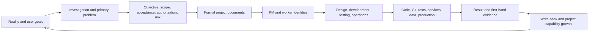
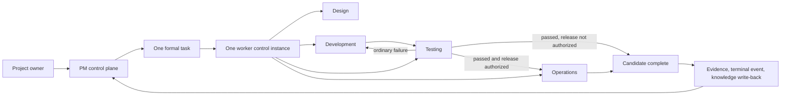

# BEYOND 3.0

**English** | [简体中文](README.zh-CN.md)


> **Beyond Chat. Build Reality.**

BEYOND is a document-driven AI engineering collaboration system for Codex. It turns goals, governance, execution, verification, and project knowledge into one continuous engineering loop instead of treating an AI response—or generated code—as completion.

Most AI coding tools focus on generating code faster. BEYOND focuses on a harder problem: helping AI understand a real project, stay within authorization, finish a complete business task, prove the result, and become more effective as project knowledge grows.

[Quick Start](docs/en/quick-start.md) · [Architecture](docs/en/architecture.md) · [Template Package](模板交付包) · [Contributing](CONTRIBUTING.en.md) · [中文首页](README.zh-CN.md)

> The current public release is `v3.0.2`. It carries the post-preview permission, reporting, evidence, and regression-guard upgrades while preserving the documented platform limitations below. The first public release was `v3.0.0-preview.1`.

## What BEYOND changes

- Goals, authorization, contracts, state, and evidence live in formal project documents rather than only in chat history.
- Design, development, testing, and operations advance one business result inside one task lifecycle.
- Ordinary implementation and test failures are repaired and retested in the same task; only real business conflicts, high-risk permissions, and irreversible actions stop for a decision.
- Technology stacks, test commands, environments, servers, and release procedures become reusable project capabilities instead of being rediscovered in every task.
- Code, Git, tests, services, data, and production remain separate sources of truth with separate authorization boundaries.

## Three methodologies, one engineering system

BEYOND combines three bodies of thought. They are not decorative slogans; each one owns a different part of the operating model.

| Foundation | Engineering interpretation | How BEYOND applies it |
| --- | --- | --- |
| **Practice-oriented methods distilled from the Selected Works of Mao Zedong** | Seek truth from facts, investigate before deciding, identify the primary contradiction, validate through practice, and learn from the people doing the work | Inspect code, Git, tests, and environments first; focus the current task on the main problem; let fresh evidence override stale assumptions; incorporate user correction and write verified knowledge back |
| **PMP and project governance** | Integrate objectives, scope, quality, risk, stakeholders, change, and closure | A PM control plane freezes the business result, explicit non-goals, acceptance criteria, permissions, and real stop conditions before execution |
| **Dao, Fa, Shu, Qi** | Move from principles, to governance mechanisms, to professional methods, and finally to tools | Principles define values and safety; documents and lifecycle contracts define governance; Skills define professional actions; Codex, Git, tests, environments, and servers provide execution reality |

BEYOND does not mechanically reproduce any source text and does not claim endorsement by any related organization. It extracts methods that can be tested against engineering facts and outcomes.

```text
Fact-based practice
        ×
Project governance
        ×
Dao · Fa · Shu · Qi
        ×
Codex execution
        =
Governable, executable, verifiable, and growing AI engineering
```

## The operating loop



One business result maps to one formal task and one task-control instance. The PM governs the portfolio and consumes lifecycle events; it does not become the developer. The worker controls the complete task lifecycle and invokes design, development, testing, and operations as actions when the task requires them.



## Documents + Skills

BEYOND separates stable project truth from reusable execution methods.

| Layer | Owns | Does not own |
| --- | --- | --- |
| Project documents | Objectives, task contracts, current state, project capabilities, evidence, and history | Active execution |
| Identity Skills | PM and worker control rights, read paths, and lifecycle rules | Project-specific facts |
| Action Skills | Design, development, testing, and operations methods | Task ownership |
| Skill references | Lower-frequency complex branches loaded only when needed | Default reading for every task |
| Code and environments | First-hand Git, test, service, server, data, and production reality | Business intent or authorization |
| Task events | Delivery of progress, conflicts, shared facts, and terminal evidence to the PM | Replacement for formal task records |

This structure keeps the safety core complete without forcing every task to read every rule. Formal documents preserve verified truth; Skills decide how to act; tools provide reality; validated discoveries return to the correct document owner.

## Quick start

The repository includes a zero-dependency Node.js fixture. You can use it to verify template import, cold start, formal task creation, development, testing, evidence, and write-back without touching Git or production.

> Loading `AGENTS.md` and Skills is not the same as having BEYOND's complete formal-task collaboration. This version supports that path only on Windows with Codex Desktop, and the current Desktop session must expose user-visible task creation, follow-up messaging, task reading, and direct user correction. Check the [support and runtime boundary](docs/en/install-permissions-platform.md) before relying on PM-to-worker routing.

Requirements:

- Windows with Codex Desktop able to read project `AGENTS.md` files and use Skills.
- Node.js 24.x, the current tested script-runtime baseline.
- A writable local directory.

Install the project template with an explicit target, then run the baseline:

```text
node scripts/beyond-install.mjs install --target <demo-directory> --dry-run
node scripts/beyond-install.mjs install --target <demo-directory>
cd <demo-directory>
npm test
npm run check
```

The example requires no `npm install` and must not create `node_modules` or a lockfile. Continue with the [English Quick Start](docs/en/quick-start.md) for template import and the first complete task.

## Upgrade path

BEYOND grew from failures observed in real engineering work. Its current architecture follows seven capability upgrades:

1. **Chat context → documented truth:** recover the current project line, boundaries, and next action from a minimal read path.
2. **Role-play → explicit control rights:** keep PM and worker identities separate; make design, development, testing, and operations task actions.
3. **Stage handoffs → task autonomy:** freeze a complete task once and continue through ordinary failures without repeated PM routing.
4. **Default trust → evidence governance:** separate file, Git, data, environment, and production truth and authorization.
5. **Single-task success → multi-task isolation:** use task ID, version, execution round, event identity, and actual source to prevent cross-task contamination.
6. **Repeated discovery → growing project capability:** initialize and refresh engineering, test, design, operations, and security baselines.
7. **Rule accumulation → product engineering:** keep a complete safety core, move low-frequency branches into references, and require RED/GREEN/regression evidence for mechanism changes.

The next public milestones are measurable performance, composable capability baselines, and community contribution without allowing one private project's rules to become global defaults.

## Repository map

```text
BEYOND/
├─ README.md                         English product home
├─ README.zh-CN.md                   Complete Chinese product home
├─ docs/                             Product documentation
├─ examples/minimal-project/         Zero-dependency public fixture
├─ 模板交付包/                        Project template and six Skills
├─ scripts/                          Public validation
├─ .github/                          Issues, PR template, and CI
├─ CHANGELOG.md                      Public version history
├─ CONTRIBUTING.md / .en.md          Contribution policy
├─ CODE_OF_CONDUCT.md / .zh-CN.md    Community standards
├─ SECURITY.md / .en.md              Security policy
└─ LICENSE                           Apache License 2.0
```

The public repository is assembled from an explicit allowlist. Internal construction records, real-project data, credentials, local task history, deployment snapshots, and the existing local Git history are not part of the public product.

## Current limitations

- The Skills and full project-template documentation are currently Chinese-first.
- The only formally supported and accepted combination for this version is Windows + Codex Desktop, with Node.js 24.x as the tested script-runtime baseline. Public CI runs the deterministic script suites on `windows-latest` with Node.js 24; it does not replace real Codex Desktop behavior evidence.
- The standard-library scripts may run on other systems, but CLI, Linux (including Ubuntu), macOS, IDE, and cloud surfaces are uncommitted and unverified. They are outside this release scope rather than promotion blockers.
- GitHub branch rules, private vulnerability reporting, and the first Release are verified; the project still needs an additional maintainer who can independently review Pull Requests.

These limits are why the first release remained a public preview. Version `v3.0.2` publishes the post-preview control and reporting fixes without extending the supported environment beyond its documented scope.

## Contributing and security

Issues and Pull Requests are welcome. Every PR must pass public checks and human review; passing tests does not guarantee acceptance. Participation is governed by the [Code of Conduct](CODE_OF_CONDUCT.md). See [Contributing](CONTRIBUTING.en.md) and the [Security Policy](SECURITY.en.md).

BEYOND is licensed under the [Apache License 2.0](LICENSE).

## Creator and maintainer

Created and maintained by [adubeyond](https://github.com/adubeyond).

`adubeyond · Creator of BEYOND`

Building BEYOND, a document-driven AI engineering collaboration system for Codex.
