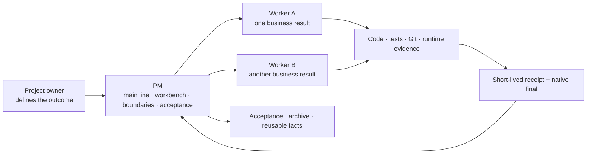

# BEYOND

**English** | [简体中文](README.zh-CN.md)


> **Beyond Chat. Build Reality.**
> Help Codex finish real project outcomes instead of stopping at answers.

BEYOND is an open-source AI project collaboration system for **local Codex Desktop projects**. It helps AI organize, advance, and deliver real outcomes beyond a single conversation. PMs understand the project, analyze product and technical questions, plan work, and verify results; Workers continuously perform the design, development, testing, and authorized operations needed for their assigned outcome.

Use one PM for the whole project or several PMs for explicit scopes. With a user-approved model policy, PMs select model-and-reasoning combinations by task, upgrade for harder problems, and downgrade when the remaining work becomes simpler, preserving the same Worker's context and results. Reusable project knowledge, focused context loading, callbacks, pause/resume, and evidence-based acceptance help reduce repeated explanations, manual chasing, and unnecessary rework.

It is built for people already using Codex on real repositories who are tired of repeated context loss, finished Workers that never return to the PM, stage-heavy workflows that require constant “continue” prompts, ambiguous claims such as “tests passed” versus “released,” and conflicting writes across parallel tasks.

[Download BEYOND v3.2.8](https://github.com/adubeyond/beyond-ai-collaboration/releases/tag/v3.2.8) · [Gitee mirror](https://gitee.com/adubeyond/beyond-ai-collaboration) · [90-second real case](docs/en/real-case-and-90-second-demo.md) · [Installation](模板交付包/docs/en/installation-upgrade-and-project-initialization.md) · [Quick Start](docs/en/quick-start.md) · [3.2.8 Upgrade Guide](docs/en/releases/v3.2.8.md) · [Architecture](docs/en/architecture.md)

## What BEYOND changes

| Real problem | BEYOND behavior |
| --- | --- |
| A new task does not know the project's current line | Objectives, the workbench, and reusable facts live in a project-local control repository |
| The PM has to wait, poll, and chase finished Workers | A Worker saves a short-lived receipt and calls the PM back on completion or genuine pause |
| Design, development, testing, and operations become manual handoffs | One Worker continuously owns the result and switches methods as needed |
| Short prompts get trapped behind framework defaults | Current explicit instructions override ordinary BEYOND preferences; clear goals execute directly and only material ambiguity triggers a question |
| “Tests passed,” “may commit,” and “may release” collapse into one permission | Files, Git, network, servers, data, and production remain separate evidence and authorization domains |
| Parallel tasks overwrite one another or close twice | The PM registers one owner and write boundary per result; acceptance and archival are idempotent |

## Core capabilities in 3.2.8

### 1. Select models by task, adjust them by stage

Neither the most expensive model for everything nor a mandatory trial of the cheapest one. Once the user enables the sweet-spot policy, PMs choose a capable combination based on the task, available plan, and delivery evidence.

| Current work | Recommended starting point |
| --- | --- |
| Clear extraction, classification, conversion, repetitive processing | GPT-6 Luna · low; high for demanding checks |
| Routine implementation, repair, documentation, ordinary plans | GPT-6.1 Sol · medium; high for denser logic |
| Polished complete UI, cross-module design, conflicting evidence | GPT-6.1 Sol · xhigh; ordinary UI is not automatically promoted |
| Architecture problems, complex diagnosis, key decisions | GPT-6 Astra · medium, raise when justified |
| Cross-system consistency or direct high-consequence execution | GPT-6.1 Sol · high; authorization and acceptance remain unchanged |

Only `beyond-worker-gpt61-v4` and platform defaults are selectable. Historical matrices remain in Git history, not as active runtime options. Upgrades recognize old approvals but require an explicit current selection; they do not reconfigure running tasks or existing threads.

The PM adjusts the same Worker at normal continuation points. First supply missing facts or guidance, then judge whether a reasoning bottleneck warrants promotion. Downgrade when the difficult part is resolved and remaining work is clear. Do not force trials of every cheaper tier or interrupt useful work to save allowance. Pass model and effort together instead of inheriting the PM's or previous stage's effort. An accepted request is not proof the host applied it.

**Priority: complete, correct delivery; total completion time; then allowance cost including rework.** Recommendations combine official starting points with product-rule verification, not guaranteed optimal settings, model benchmarks, or fixed savings. Defaults remain unless enabled; the PM's own configuration is unchanged. User locks, budgets, and host availability take precedence.

### 2. PM judgment, with whole-project or scoped responsibility

PMs interpret objectives using project context, make product and technical judgments, and turn brief requests into an outcome, boundary, and acceptance criteria. When work drifts, they identify the gap and guide the original Worker rather than merely rejecting completion and stopping.

One PM can manage a small project; several PMs can manage explicit scopes with a shared understanding of the overall objective. Independent results run in parallel and real dependencies are coordinated directly. Each result keeps one responsible owner and one formal Worker, without an extra supervisory layer or requiring the user to relay messages.

### 3. One Worker continuously delivers one outcome

Design, development, testing, and operations are methods selected as needed, not four mandatory handoffs. Ordinary errors, repair, and retesting stay in the same task. Checkpoints, rework, and missing evidence keep the same Worker rather than repeatedly creating new conversations.

If an execution turn ends before the task is complete, the Worker reports what is done, what remains, and the next step so the PM can guide continuation within existing authority. Genuine business choices, additional high-risk authorization, unresolved shared conflicts, or unavailable essential resources can require a pause; the original Worker resumes when the condition is resolved.

### 4. Reusable project knowledge, context supplied on demand

Goals, architecture, development conventions, tests, operational entry points, and user corrections have identifiable project sources. New PMs learn the overall project before dispatching work; Workers load facts relevant to their result instead of receiving every project document.

Existing documents can stay in place with registered entry points. Stale documents must be checked against current evidence rather than treated as unquestionable instructions. Missing documentation is not a new gate when safe investigation can establish the needed facts.

### 5. Reporting, verification, and recovery close the loop

On completion or genuine pause, Workers save a short-lived receipt and call their PM back. The PM checks the current turn's completion, formal result, and acceptance evidence before updating the workbench and acknowledging the receipt. Repeated notifications do not duplicate acceptance. User-cancelled work can close with history without pretending it was completed.

Busy PMs handle injected callbacks at safe tool boundaries and then continue the original user request, retaining both foreground and background results. Visibility races have a bounded wait of up to one minute and a strictly scoped, read-only local final fallback. If the host does not start a processing turn, pending results can be checked on the next natural PM turn. These are recovery paths, not a guarantee that every callback will always be processed automatically.

### 6. Optional CLI collaboration with retained-session goal loops

The native Desktop Worker route remains the default. Optional routes support PM → Worker → CLI and PM or Worker → CLI. The CLI runs in the specified project and authorization boundary, retaining its session and observable events. After a run it notifies the owner, who checks the outcome and guides the same session or accepts the result without continuously waiting alongside it.

A notification means a run ended, not that the business goal was achieved. Direct CLI work has its own result and acceptance records instead of impersonating Worker receipts; Worker-mediated work still returns through the original Worker protocol. Recovery, concurrency isolation, duplicate-notification suppression, and explicit closure after a goal change are supported. Third-party API settings and authentication come from the existing local CLI profile, not the user's Codex subscription or credentials shipped in the package.

### 7. Lightweight adoption with real boundaries

Project entry files, six Skills, and local control scripts work without a new persistent daemon, Hook, or second task scheduler. Non-Git projects, single repositories, multiple repositories, and platform-provided worktrees are supported; project identity and execution location are verified separately to prevent cross-project writes.

Current explicit goals and authorization override ordinary workflow preferences. Tools follow the actual task rather than making either CLI or browser the only route; permission to edit code does not imply permission to change production. Installation replaces manifest-owned product content while preserving project knowledge and runtime state. External checksum files are optional, but a supplied mismatch still requires stopping.

## How it works


```mermaid
flowchart LR
    U["Project owner\ndefines the outcome"] --> PM["PM\nmain line · workbench · boundaries · acceptance"]
    PM --> W1["Worker A\none business result"]
    PM --> W2["Worker B\nanother business result"]
    W1 --> E["Code · tests · Git · runtime evidence"]
    W2 --> E
    E --> R["Short-lived receipt + native final"]
    R --> PM
    PM --> S["Acceptance · archive · reusable facts"]
```

The PM understands objectives, analyzes problems, designs tasks, and corrects course rather than merely forwarding work or continuously polling Workers. A Worker continuously performs authorized work; if its execution turn ends before the task is done, it reports the remaining result so the PM can guide the same Worker within the existing authorization. On completion or genuine pause, the Worker freezes its final, stores a short-lived receipt, and sends one callback. The PM verifies that the current turn has ended and checks the formal result and evidence before closeout. A callback alone does not prove that the Worker has finished.

## Start in three steps

### 1. Download the official release

- [BEYOND-3.2.8.zip](https://github.com/adubeyond/beyond-ai-collaboration/releases/download/v3.2.8/BEYOND-3.2.8.zip)
- [BEYOND-3.2.8.zip.sha256 (optional checksum)](https://github.com/adubeyond/beyond-ai-collaboration/releases/download/v3.2.8/BEYOND-3.2.8.zip.sha256)

The ZIP is sufficient for installation. A missing or unavailable `.sha256` file does not block installation; if a checksum file is supplied and does not match, stop. See the [Installation, Upgrade, and Project Initialization Guide](模板交付包/docs/en/installation-upgrade-and-project-initialization.md) for exact commands.

### 2. Let Codex install it

Open a new ordinary Codex task in the target project and send this prompt without invoking an identity Skill:

```text
This is BEYOND installation maintenance. Do not create a PM, Worker, or business task.
Use the verified official BEYOND 3.2.8 package I downloaded to install or upgrade this project's beyond-control directory and six global Skills.
Create a precise backup first. Preserve native project rules and real content under local, projects, and shared; never replace them with empty templates.
Fuse the project entry, run installation verification, then stop and wait for me to restart Codex. Do not start, resume, or modify business tasks.
```

Installation adds the project-local `beyond-control/`, fuses the root `AGENTS.md`, and installs six user-level Skills:

```text
identity-pm      identity-worker
task-design      task-dev
task-test        task-ops
```

BEYOND 3.2.8 does not install an identity Hook, notify branch, persistent daemon, or extra Codex CLI. The optional route uses an existing local CLI with finite per-dispatch background execution and notification; it does not replace the default Desktop route.

### 3. Restart and adopt the project

Restart Codex after replacing global Skills. Open a new task at the project root:

```text
$identity-pm
Use BEYOND to initialize this new project.
```

For an existing project:

```text
$identity-pm
Use BEYOND to adopt or upgrade this existing project.
```

After minimum adoption, either complete initialization now or begin work and fill remaining fact groups on demand. BEYOND does not force an empty project to invent servers, deployment paths, or business facts.

## A real task example

```text
$identity-pm

Outcome: add batch export to the order module and prove that the generated file downloads in the test environment.
Non-goals: do not modify production data and do not deploy to production.
Acceptance: existing tests pass, a new export test passes, and one real download is verified in the test environment.
Authorization: code changes, tests, one local commit, and test-environment deployment are allowed; push and production release are not.

Register one formal task and let one Worker continuously perform the required design, development, testing, and test-environment verification.
```

When the result is clear, the PM dispatches it directly. The Worker does not split design, development, and testing into separate outcomes that require repeated “continue” prompts. Ordinary failures are repaired and retested in the same task; a genuine business decision or high-risk permission gap causes a real pause.

## Who it is for

BEYOND is a good fit for:

- solo developers, one-person companies, and small teams maintaining real projects with Codex;
- several concurrent feature, defect, data, operations, or release tasks;
- projects that need durable memory, recovery, permission separation, and evidence-based acceptance;
- users who want less process and less manual prompting without weakening production boundaries.

It is not currently a good fit for:

- one-off questions, copywriting, or simple requests with no project state;
- platforms without project tasks, Skills, or thread callbacks;
- autonomous production changes without an explicit target, authorization, verification, and rollback boundary.

## Current boundaries

- The current stable release is `v3.2.8`, primarily for local Codex Desktop projects.
- Standard installation and operation have been validated in real Windows projects; public checks also cover package contents, installation structure, and the minimal fixture.
- Task creation, callbacks, and persistent permissions vary across platforms. Evidence from one platform is not a universal compatibility claim.
- This release adds a read-only local fallback for completed tasks whose final text is unavailable through the platform. It does not guarantee compatibility with every host version or eliminate long-context goal drift.
- BEYOND collects no installation telemetry. GitHub Release download counts measure release-asset downloads only, not every installation or active user.

## Documentation

| Goal | Start here |
| --- | --- |
| See a real completion and pause/resume path | [Real case and 90-second demo](docs/en/real-case-and-90-second-demo.md) |
| Install, upgrade, or roll back | [Installation, Upgrade, and Project Initialization](模板交付包/docs/en/installation-upgrade-and-project-initialization.md) |
| Try a clean fixture | [Quick Start](docs/en/quick-start.md) |
| Understand PM, Worker, documents, and runtime | [Architecture](docs/en/architecture.md) |
| Review 3.2.8 changes | [Upgrade Guide](docs/en/releases/v3.2.8.md) · [CHANGELOG](CHANGELOG.md) |
| Inspect the control repository | [Template Package](模板交付包/README.md) |
| Report a problem or propose an improvement | [Issues](https://github.com/adubeyond/beyond-ai-collaboration/issues) · [Contributing](CONTRIBUTING.en.md) |
| Report a vulnerability privately | [Security Policy](SECURITY.en.md) |

## Open source

BEYOND is licensed under the [Apache License 2.0](LICENSE). Issues and Pull Requests pass public checks and human review; passing tests does not guarantee acceptance.

Created and maintained by [adubeyond](https://github.com/adubeyond).

`adubeyond · Creator of BEYOND`

> **Beyond Chat. Build Reality.**
