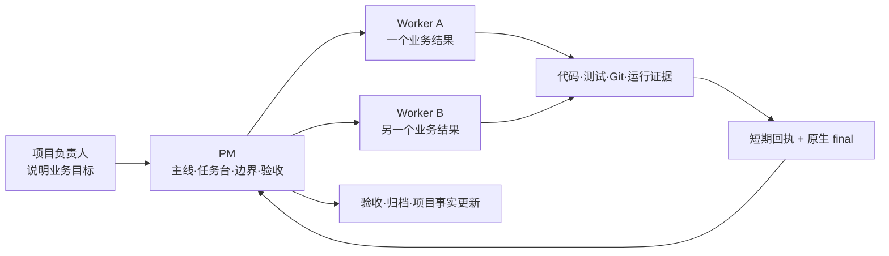

# BEYOND

[English](README.md) | **简体中文**


> **Beyond Chat. Build Reality.**
> 让 Codex 不只回答问题，而是持续完成真实项目目标。

BEYOND 是一套面向 **Codex Desktop 本地项目**的开源 AI 工程协同系统。它用一个 PM 管理主线与验收，让每个 Worker 对一个业务结果连续负责，并把项目事实、权限边界、当前证据和任务状态放回可恢复的正式入口。

它适合已经在用 Codex 做真实开发，但正在被这些问题困扰的人：新对话反复失忆、任务完成后无人收口、阶段过多需要人工续推、测试通过却无法判断能否发布，以及多个任务并行时责任和写入边界混乱。

[下载 BEYOND v3.2.4](https://github.com/adubeyond/beyond-ai-collaboration/releases/tag/v3.2.4) · [Gitee 镜像](https://gitee.com/adubeyond/beyond-ai-collaboration) · [90 秒真实案例](docs/真实案例与90秒演示.md) · [安装指南](模板交付包/docs/安装升级与项目初始化指南.md) · [快速开始](docs/快速开始.md) · [3.2.4 升级说明](docs/releases/v3.2.4.md) · [系统架构](docs/系统架构与运行机制.md)

## BEYOND 带来什么

| 真实问题 | BEYOND 的处理 |
| --- | --- |
| 新对话不知道项目做到哪里 | 项目目标、当前主线、任务台和长期事实保存在项目内控制仓 |
| PM 派完任务后需要不断等待、轮询和催促 | Worker 完成或暂停时保存短期回执并原生回调；PM被唤醒后统一验收 |
| 设计、开发、测试、运维被拆成多轮人工接力 | 一个业务结果由同一 Worker连续推进，动作能力按需要切换 |
| 提示词越短，AI越容易被规则拖入长路径 | 当前明确指令优先于BEYOND默认偏好；目标清晰直接执行，真正歧义才询问 |
| 测试通过、允许改文件、允许提交和允许发布被混为一谈 | 文件、Git、网络、服务器、数据和生产权限分别判断 |
| 多个任务并行时互相覆盖或重复验收 | PM登记唯一Worker和写入边界；同一结果只验收、归档一次 |

## 3.2.4 的核心能力

- **多结果同回合派发**：一条明确指令批准多个独立结果时，PM逐个创建并登记，不在中间等待或轮询Worker。
- **控制仓隔离**：终态runtime只取当前项目根映射；错误项目编号在写入pending前被拒绝，不能跨项目误写。
- **终态有界恢复**：原生回调仍是主触发；宿主遗漏可执行收口回合时，下一次自然PM回合只补读一次活动任务pending。
- **轻量安装**：非Git项目可以直接安装；Windows备份统一包含隐藏文件并按路径、字节和哈希对账。
- **目标优先**：用户当前明确的目标、边界和授权优先于BEYOND普通偏好和历史习惯。
- **必要才澄清**：能从代码、配置、Git、测试和环境查明的内容先调查；只有答案会改变业务结果时才问用户。
- **一个结果，一个Worker**：PM管理项目和任务组合，Worker拥有并连续交付单个业务结果。
- **任务内连续执行**：设计、开发、测试和运维是同一Worker可切换的方法，不是四个互相等待的机器人。
- **证据决定结论**：代码自述不等于测试通过，测试通过不等于已经提交、发布或生产可用。
- **可靠终态回传**：Worker在回调前保存与正式final一致的短期回执；PM成功提交工作台状态后立即删除。
- **CLI优先但服从当前指令**：能力相同时优先命令行；用户明确要求网页或任务依赖现有浏览器登录态时使用浏览器。
- **真实安全边界**：当前授权可以覆盖普通执行偏好，但不会自动扩张为凭据、生产、共享数据或破坏性操作授权。

## 它怎样工作



PM不会代替Worker写代码，也不会为了“掌控进度”持续读取和轮询Worker。Worker完成全部业务动作后冻结final、保存短期回执、执行一次轻量回调并结束；PM醒来后扫描正式任务与待处理回执，核对证据并幂等收口。

## 三步开始

### 1. 下载正式版本

- [BEYOND-3.2.4.zip](https://github.com/adubeyond/beyond-ai-collaboration/releases/download/v3.2.4/BEYOND-3.2.4.zip)
- [BEYOND-3.2.4.zip.sha256](https://github.com/adubeyond/beyond-ai-collaboration/releases/download/v3.2.4/BEYOND-3.2.4.zip.sha256)

先核对校验文件，再解压。完整命令见[安装、升级与项目初始化指南](模板交付包/docs/安装升级与项目初始化指南.md)。

### 2. 让 Codex 完成安装

在目标项目的新普通对话中发送下面这段话，不调用身份Skill：

```text
这是BEYOND安装维护请求，不建立PM、Worker或业务任务。
请使用我已下载并验真通过的BEYOND 3.2.4正式发布包，安装或升级当前项目的beyond-control和六个全局Skill。
先精确备份；保留项目原生规则以及local、projects、shared中的真实内容，不用空模板覆盖。
完成项目入口融合和安装验真后停止，等待我重启Codex。不要启动、恢复或修改业务任务。
```

安装会写入项目根的`beyond-control/`、融合根`AGENTS.md`，并安装六个用户级Skills：

```text
identity-pm      identity-worker
task-design      task-dev
task-test        task-ops
```

BEYOND 3.2.4不安装身份Hook、notify分支、守护进程或额外Codex CLI。

### 3. 重启并接手项目

替换全局Skill后重启Codex。在项目根新建对话：

```text
$identity-pm
使用 BEYOND 初始化这个新项目。
```

已有项目改为：

```text
$identity-pm
使用 BEYOND 接入或升级这个已有项目。
```

最低接入后，你可以选择立即完整初始化，或先开始使用、以后按需补齐。BEYOND不会要求空白项目先编造服务器、部署或业务事实。

## 一个真实任务是什么样

```text
$identity-pm

目标：为订单模块增加批量导出，并在测试环境验证导出文件可下载。
明确不做：不修改生产数据，不发布生产。
验收：现有测试通过；新增导出测试通过；测试环境取得一次真实下载证据。
权限：允许修改代码、运行测试、创建本地提交并部署测试环境；不允许推送或生产发布。

请登记一个正式任务，由唯一Worker连续完成需要的设计、开发、测试和测试环境验证。
```

目标已经清楚时，PM直接登记并派发；Worker不会把设计、开发、测试拆成需要你反复输入“继续”的多个结果。普通失败在原任务中修复回测，真正缺少业务决定或高风险授权时才暂停。

## 适合与不适合

适合：

- 独立开发者、一人公司和小团队，用 Codex长期维护真实项目；
- 同时推进多个功能、缺陷、数据、运维或发布任务；
- 需要项目记忆、任务恢复、权限分离和证据验收；
- 希望AI少走流程、少靠人工续推，但仍能守住生产边界。

暂不适合：

- 只做一次性问答、文案或无需项目状态的简单请求；
- 不支持项目任务、Skills和线程回调的平台；
- 希望AI在没有明确授权、目标环境或回滚条件时自动操作生产系统。

## 当前边界

- 当前正式版本是`v3.2.4`，主要面向Codex Desktop本地项目。
- 标准安装与运行路径已在真实Windows项目中验证；公开脚本同时覆盖内容、安装结构和最小示例。
- 不同平台对任务创建、线程回调和持久权限的支持不同，不能把一个平台的通过结论外推到所有环境。
- BEYOND不收集安装遥测；GitHub Release下载量只能统计发布资产下载，不能代表全部安装或实际活跃用户。

## 文档入口

| 想做什么 | 从这里开始 |
| --- | --- |
| 看一次真实完成与暂停恢复 | [真实案例与 90 秒演示](docs/真实案例与90秒演示.md) |
| 安装、升级或回退 | [安装、升级与项目初始化指南](模板交付包/docs/安装升级与项目初始化指南.md) |
| 在干净示例中体验 | [快速开始](docs/快速开始.md) |
| 理解PM、Worker、文档和运行时 | [系统架构与运行机制](docs/系统架构与运行机制.md) |
| 查看3.2.4变化 | [升级说明](docs/releases/v3.2.4.md) · [CHANGELOG](CHANGELOG.md) |
| 阅读控制仓结构 | [模板交付包说明](模板交付包/README.md) |
| 提交问题或改进 | [Issues](https://github.com/adubeyond/beyond-ai-collaboration/issues) · [贡献指南](CONTRIBUTING.md) |
| 私密报告安全问题 | [安全政策](SECURITY.md) |

## 开源与维护

BEYOND 使用 [Apache License 2.0](LICENSE)。Issue与PR需要经过公开验证和人工审查；测试通过不等于自动采纳。

由 [adubeyond](https://github.com/adubeyond) 创建并维护。

`adubeyond · Creator of BEYOND`

> **超越对话，抵达结果。**
