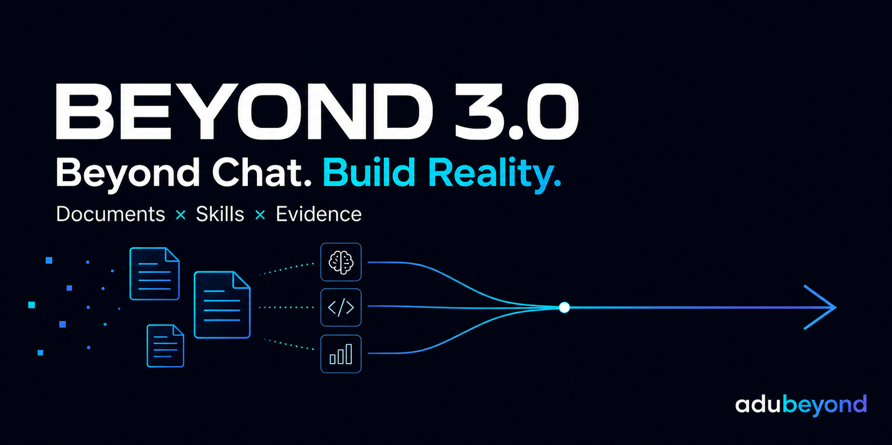
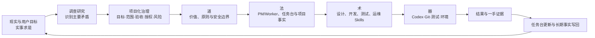
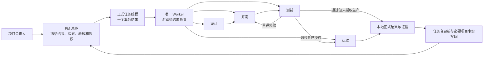

# BEYOND 3.2

[English](README.md) | **简体中文**



> **Beyond Chat. Build Reality.**
>
> 超越对话，抵达结果。

BEYOND 是一套面向 Codex 的文档驱动 AI 工程协同系统。它不把“AI 回答了”当成完成，而是让业务目标、项目治理、连续执行、测试证据和知识沉淀形成一个真正闭环。

许多 AI 编程工具解决的是“怎样更快生成代码”。BEYOND 继续向前一步，解决“怎样让 AI 在真实项目中持续理解方向、守住边界、完成任务、验证结果，并让下一次做得更熟练”。

[安装、升级与项目初始化](模板交付包/docs/安装升级与项目初始化指南.md) · [快速开始](docs/快速开始.md) · [v3.2.0升级说明](docs/releases/v3.2.0.md) · [系统架构](docs/系统架构与运行机制.md) · [控制仓交付包](模板交付包) · [参与贡献](CONTRIBUTING.md)

> 当前正式版本为`v3.2.0`。它以Worker正式final为任务结果真值，用一次平台原生轻量唤醒让PM在回答边界后自动收敛结果，并以确定性的项目身份与工作台事务保证升级、验收和归档一致。

## 1. 产品能力

BEYOND 通过以下机制管理真实项目中的 AI 工程任务：

- 项目根下的`beyond-control/`保存BEYOND文档和项目稳定事实，本机任务台保存个人进度；需要跨多个完全独立项目共享时才由用户选择外置控制仓。技术栈、服务器和发布路径不只依赖聊天上下文。
- 多人协作时，团队任务与协同通过同一个内部控制仓共享；个人模式不读取这条路径。
- 设计、开发、测试和运维围绕一个业务结果连续推进，动作切换不制造新任务或审批点。
- 技术栈、测试入口、服务器和发布流程沉淀为长期项目事实，后续任务按需复用和更新。
- 生产任务一次建立目标、制品、授权、验证和回滚上下文；后续只刷新变化项，不在预检、发布和复验之间反复确认。
- 原则、治理机制、专业方法和执行工具分层组织；Codex、Git、测试、环境和服务器各自提供对应的一手现实。
- 普通失败在原任务中修复并回测；只有业务决定、高风险动作、真实共享冲突和外部资源缺失才暂停。
- 正式 Worker只建立在全新、用户可见且绑定正式项目的任务中，不用fork、projectless或父PM历史承载业务控制权。

BEYOND 的产品公式是：

```text
实事求是的实践方法
        ×
PMP 的项目治理
        ×
道、法、术、器的能力分层
        ×
Codex 的执行能力
        =
可治理、可执行、可验证、可成长的 AI 工程协同系统
```

## 2. 三套方法论，一套工程系统

BEYOND 的底层不是一组临时拼接的提示词，而是三套方法论的融合。

| 方法论来源 | 提炼的核心 | 在 BEYOND 中的实现 | 最终作用 |
| --- | --- | --- | --- |
| **毛选中的实践方法论** | 实事求是、调查研究、分析主要矛盾、实践检验和群众路线 | 先调查代码、Git、测试和环境；识别当前主要问题；不让旧文档压过一手现实；用户在任务中纠偏后继续执行并回写 | 避免脱离项目现实，也避免为了流程而流程 |
| **PMP/项目管理方法** | 整合、目标、范围、进度、质量、风险、干系人、变更与收口 | PM 明确业务结果、范围、验收和真实停止条件；任务台管理团队；证据驱动收口 | 把模糊意图变成可管理、可验收的项目结果 |
| **道法术器** | 先定原则，再建机制，再用方法，最后选择工具 | 道是价值与安全原则；法是 PM/Worker、任务台、项目事实和协同边界；术是设计/开发/测试/运维 Skills；器是 Codex、Git、测试、环境和服务器 | 防止只堆工具和提示词，让能力层次清楚、能够长期演进 |

这三套方法论并不是三条平行的口号：

- 毛选中的实践方法论回答：**怎样认识真实问题，怎样在行动中校正认识。**
- PMP 回答：**怎样把问题变成有目标、有边界、有风险控制的完整项目。**
- 道法术器回答：**怎样把原则逐层落到机制、专业动作和执行工具。**

BEYOND 不机械复刻任何理论原文，也不声称获得相关机构背书。它提炼的是能够被工程事实和结果验证的方法。

## 3. 底层运行闭环



这个闭环决定了 BEYOND 的几个关键行为：

1. **事实优先**：能从代码、配置、Git、测试和环境确认的内容先调查，不把所有未知都变成用户问卷。
2. **抓住主线**：一个业务结果对应一个正式任务和一个 Worker，避免阶段和责任无限分裂。
3. **项目化委派**：PM用紧凑任务包明确结果、边界、验收、正式目标、事实入口和真实停止条件；任务包只定义业务契约，不替Worker展开执行步骤。
4. **分层执行**：文档保存真值，Skills 固定方法，工具提供现实，任何一层都不越权代替另一层。
5. **实践检验**：开发自述不是完成，当前轮测试、运行现实和正式证据才决定结论。
6. **长期复用**：本轮确认的新事实写回项目事实，让系统随着项目推进越来越熟练。

## 4. 从提示词到工程系统：BEYOND 的升级路径

BEYOND 不是一开始就有今天的结构。它是在真实项目反复暴露问题后逐层升级出来的，每一次升级都要回答“为什么改、规则归谁、怎样证明、怎样防止回退”。

这里展示的是实际能力演进顺序，不是为了宣传而虚构的版本故事：

| 演进阶段 | 当时的主要问题 | 关键升级 | 形成的能力 |
| --- | --- | --- | --- |
| **从聊天到文档真值** | 新对话失忆，建设资料、真实项目和历史记录容易混读 | 建立首入口、模式隔离、当前工作台、任务卡、项目事实和历史回收 | AI 能从最小路径恢复当前主线、边界和下一步 |
| **从角色扮演到控制权** | PM 下场编码，开发与测试互相派生，多个对话争夺同一任务 | 固定 PM 与执行者两个身份；设计、开发、测试、运维降为任务内动作能力 | 一个业务结果只有一个正式任务和一个 Worker |
| **从阶段接力到任务自治** | 每完成一步就停下等待续派，普通测试失败也回到 PM | 紧凑业务契约一次授权；任务内切换动作；普通失败自动修复回测 | 任务能够从设计连续推进到正式交付或真实暂停 |
| **从默认信任到证据治理** | 开发自述被当成测试结论，测试通过被误认为可以发布 | 分离文件、Git、数据、环境和生产授权；建立一手证据、完成剖面与发布锚点 | 每个结论都能说明依据，权限不会沿流程静默扩张 |
| **从单线可用到多任务协同** | 多个任务同时写入容易串线和互相覆盖 | PM任务台管理负责人和进度；同目录按路径/对象划界并行，Git索引与提交串行 | PM 看得见团队，又不接管阶段执行 |
| **从每次摸索到长期事实复用** | 开发、测试和运维反复寻找同一套技术栈、命令、服务器和发布流程 | 建立工程、设计、测试、运维和安全事实入口；需要时调查写回，后续直接复用 | 系统随着项目推进越来越熟练，而不是每次重新入职 |
| **从规则堆叠到职责归位** | Skill 太重会拖慢执行，治理手续会反过来阻塞业务 | PM管团队、Worker管结果、Skill管方法、文档管知识；安全只拦真实风险 | 核心路径更短，生产级底线仍然保留 |

### 下一阶段路线

BEYOND 接下来不会以“增加更多规则”为目标，而会沿四条路线继续进化：

1. **可安装**：在干净环境完成跨平台安装、初始化、升级和回滚验证。
2. **可度量**：分开记录模型等待、平台调度、Skill 读取和真实执行成本，在不削弱完成度的前提下优化效率。
3. **可扩展**：让项目事实、动作 references 和验证夹具可以按项目类型组合，而不污染核心规则。
4. **可共建**：通过 Apache-2.0、Issues、PR、公开测试和人工审查吸收通用改进，但不把单一项目经验直接写成全局规则。

升级遵循结果导向：**先确认真实问题和受影响路径，再修改唯一规则所有者，运行与问题直接相关的验证和相邻回归；证据、兼容与部署边界闭合后，能力才进入系统。验证顺序由问题决定，不为流程预先制造失败测试或新对话。**

## 5. 它解决什么问题

普通的 AI 编程对话很容易在真实项目中遇到这些问题：

- 新对话不知道项目当前主线、边界和下一步。
- PM 下达的任务缺少验收、授权或停止条件，执行中反复回来补问。
- 设计、开发、测试、运维被拆成多个等待续派的阶段，普通失败也会让任务停住。
- 多个开发任务同时运行时，负责人、进度、契约和共享写入容易串线。
- 每次开发、测试和发布都重新寻找技术栈、命令、服务器和发布流程。
- “代码写完”“测试通过”“允许改文件”“允许发布”被错误地混成同一种授权。
- 结果只留在聊天里，后续任务无法稳定复用。

| 常见对话式做法 | BEYOND 的处理 |
| --- | --- |
| 靠一段长提示词携带全部上下文 | 用分层项目文档保存稳定真值，按任务最小读取 |
| PM、开发、测试在多个对话间反复中继 | 一个业务结果由一个 Worker 连续推进 |
| 测试失败后停下等待再次派单 | 授权范围内自动修复并回到原测试路径 |
| 每次都重新摸索技术栈和发布流程 | 当前任务确认长期事实时写回标准入口，后续按需复用 |
| “测试通过”被理解成“可以上线” | 文件、Git、数据、环境和生产权限分别授权 |
| 完成结果只留在聊天摘要中 | Git、当前测试、正式结果和必要项目事实回到各自入口 |
| 多任务回报混入同一个控制面 | 任务台按正式 thread记录负责人、三态、进度和结果 |

## 6. 核心模型

系统只有两个身份：

- `PM 总控`：管理项目主线、任务台、负责人、写入顺序、真实暂停和最终验收。
- `执行者`：对一个业务结果连续负责，并对最终结果负责。

系统提供四种可组合的动作能力：

- `设计`：收敛目标、边界、架构、契约和验收。
- `开发`：依据正式设计和工程事实实现并完成当前轮自测。
- `测试`：使用当前轮一手证据给出通过、不通过或不能判断。
- `运维`：依据真实环境、发布手册和授权完成预检、发布、验证或回滚。

设计、开发、测试、运维不是四个互相等待的机器人。它们是同一个 Worker 按当前事实切换的动作能力。



## 7. 为什么是“文档＋Skills”

| 组成 | 负责什么 | 不负责什么 |
| --- | --- | --- |
| 项目文档 | 保存项目目标、任务台和长期项目事实 | 不主动执行任务，不替代 Git和测试 |
| 身份 Skills | 固定 PM 与执行者的责任、读入路径、暂停和完成 | 不代替项目事实 |
| 动作 Skills | 固定设计、开发、测试、运维的专业流程和安全核心 | 不拥有任务控制权 |
| Skill references | 保存低频复杂分支，按需读取 | 不进入每次任务默认读入 |
| 代码与真实环境 | 提供 Git、测试、服务、服务器和生产的一手现实 | 不自动解释业务目标和授权 |
| 正式任务线程 | 保存任务执行、低频进展、暂停或完成结果 | 不替代 Git和一手证据 |

文档不是提示词附件，Skills 也不是第二套项目真值。Skills 根据任务需要读取正式文档和现场现实，执行动作并把经过验证的新事实写回正确位置。

完整机制见[BEYOND 3.0 系统架构、文档机制与使用说明](docs/系统架构与运行机制.md)。

## 8. 一个任务怎样完成

1. 项目负责人向 PM 说明业务结果、明确不做和关键授权。
2. PM 登记任务台，只对真正改变方向或高风险权限的缺口做最小补问。
3. PM 用紧凑任务包创建一个全新、绑定正式项目的用户可见任务线程，首行只显式加载 Worker身份；不使用fork或projectless任务，Action Skill由Worker按当前问题选择。
4. 执行者成为唯一 Worker，读取当前动作需要的项目事实，并可按现场切换后续方法。
5. 执行者按需要组合设计、开发、测试和运维，不机械拆成四个任务。
6. 普通构建或测试失败在原任务中修复并回测；只有四类真实原因才暂停。
7. 任务完成后返回正式结果、一手证据和必要的项目事实更新。
8. PM 验收并更新当前工作台。

项目事实缺失不会自动停工。当前任务需要时由 Worker定点调查，并把确认后具有复用价值的事实写入标准入口；不需要时不创建、不阻塞。

## 9. 适合哪些场景

- 单个功能从需求、实现、测试连续推进到正式交付。
- 缺陷定位、最小修复、原失败路径复测和受影响回归。
- 多个业务任务按文件、模块和共享对象划界并行，只为真实重叠和共享 Git动作安排顺序。
- 前端、后端、数据、爬虫、测试、运维等多条执行线协作。
- 新项目在真实任务中逐步建立技术栈、测试入口、服务器和发布流程。
- 已运行项目复用工程、测试和运维事实，减少重复摸索。
- 发布前检查、正式发布、发布后验证与失败回滚。

## 10. 快速开始

### 10.1 建立控制仓

把[模板交付包](模板交付包)完整复制到业务项目根下并命名为`beyond-control`，不要把交付包内容散着覆盖项目原文件：

```text
业务项目/
├─ beyond-control/
└─ <原有代码与文档>
```

模板文件只提供机制和格式，不预装任何真实项目的服务器、凭据、技术栈或业务事实。

从项目根先运行`node beyond-control/scripts/beyond-control.mjs init-control --project-root "."`。项目本身是Git仓库时，这一步会把独立控制仓和本机备份目录加入项目根`.gitignore`，避免误收为业务代码。新项目和已有项目都先显式进入`$identity-pm`，再分别输入`使用 BEYOND 初始化这个新项目。`或`使用 BEYOND 接入或升级这个已有项目。`已有项目先调查再逐组融合，不整目录覆盖，不自动删除原文档；该核对不进入后续普通任务路径。

本地入口融合不自动推送远端。固定脚本会建立共享项目登记、最小项目总览和最小事实索引。老项目已有Hook时只精确移除BEYOND旧身份护栏处理器，其他Hook原样保留。需要让其他成员复用项目登记时，用户另行授权远端Git后，由PM用`project-registration`范围只推送同一项目的三份基础文件。

### 10.2 安装 Skills

将`beyond-control/skills/`中的六个Skill安装到当前Codex的Skills目录；如果当前环境尚未安装，可以显式引用对应`SKILL.md`路径。完成项目入口融合并运行验真后即可使用；只有当前客户端明确仍缓存旧Skill时才需要重启Codex。

首次安装、老项目升级和可复制提示词统一见[安装、升级与项目初始化指南](模板交付包/docs/安装升级与项目初始化指南.md)；机制与源码入口见[模板交付包说明](模板交付包/README.md)。

希望先在干净项目中体验时，按[快速开始](docs/快速开始.md)使用仓库内的[最小示例](examples/minimal-project/README.md)。

### 10.3 启动项目

在项目根目录启动一个新任务，推荐输入：

```text
$identity-pm 以 PM 总控身份接手当前项目。
先按根 AGENTS.md 的最小读入链判断当前主线、边界和下一步。
```

空白项目会被引导补齐当前阶段确实需要的项目事实；已有项目会优先调查代码、配置、Git、测试和环境，不把可调查内容转成用户问卷。最低接入后，用户对“完整初始化”或“先使用、后续按需补齐”的选择和逐组进度写入项目总览，可跨对话恢复，不能把最低接入冒充完整初始化。

### 10.4 下达第一个完整任务

```text
$identity-pm
我要实现：<业务结果>。
明确不做：<范围外内容>。
验收：<可以判定完成的结果>。
权限：<允许修改、测试、Git、发布等范围>。
请形成紧凑任务包并创建全新、绑定正式项目的用户可见任务线程，由执行者连续完成需要的设计、开发、测试和运维动作。
```

提示不完整时，PM 应先调查，再只问一个真正改变结果的问题。

## 11. 默认安全边界

- 文件写入、Git 暂存、提交、推送、合并、服务器、生产、数据和不可逆操作分别授权。
- 测试通过不自动构成生产发布授权。
- 历史记录、口头摘要和开发自述不能代替当前轮一手证据。
- 一个业务结果只有一个正式任务线程和一个 Worker。
- 父PM历史、旧授权和旧凭据不自动进入新Worker控制上下文；“继续不要停”也不自动授权定时器、周期唤醒或长期监控。
- 发布必须闭合完整候选、数据库/配置/依赖状态和真实业务主链路；健康接口或页面可开不等于用户可用。
- 同一目录内边界不重叠的 Worker可以并行编辑和测试；共享对象及同一 Git工作区的索引、HEAD和历史动作串行。
- 普通失败默认任务内修复；只有业务决定、高风险动作、真实共享冲突和外部资源缺失才暂停。
- 真实代码、Git、测试、环境或生产与旧文档冲突时，先按当前现实纠偏，再刷新文档。

## 12. 仓库地图

| 路径 | 面向谁 | 用途 |
| --- | --- | --- |
| [模板交付包](模板交付包) | 模板使用者 | 可在项目根下建立独立控制仓的正式机制、文档、共享结构、固定脚本和 Skills源码；外置模式按用户选择启用 |
| [产品文档](docs/README.md) | 评估者、使用者、贡献者 | 产品说明、快速开始和长期架构文档入口 |
| [BEYOND 系统架构说明](docs/系统架构与运行机制.md) | 评估者、使用者、贡献者 | 理解文档、Skills、任务、事实和证据怎样组合运行 |
| [最小示例](examples/minimal-project/README.md) | 第一次使用者 | 在零第三方依赖项目中验证任务台、开发和测试闭环 |
| [贡献指南](CONTRIBUTING.md) | Issue 和 PR 提交者 | 理解贡献范围、测试要求、人工审查和不承诺采纳原则 |
| [社区行为准则](CODE_OF_CONDUCT.zh-CN.md) | 所有参与者 | 理解社区沟通边界、私密报告和违规处理方式 |
| [安全政策](SECURITY.md) | 安全问题报告者 | 使用私密入口报告漏洞，避免公开泄露敏感信息 |
| [公开验证脚本](scripts/check-public-content.mjs) | 贡献者、维护者 | 检查公开范围、链接、编码、敏感残留和示例夹具 |

## 13. 贡献与许可

本项目采用[Apache License 2.0](LICENSE)。许可证规定代码和文档可以怎样使用、修改与再分发，但不赋予任何提交自动进入项目的权利。

项目开放 Issues 和 PR：

- Issue 用于报告可复现缺陷、文档问题和通用功能建议。
- PR 必须通过公开验证，并经过有合并权限的维护者人工审查和批准。
- 测试通过不等于自动采纳；维护者可以因为产品方向、兼容性、安全或维护成本要求修改、暂缓或不合并。
- 项目不承诺 Issue 响应时间、PR 合并时间或功能交付时间。

提交前请阅读[贡献指南](CONTRIBUTING.md)和[社区行为准则](CODE_OF_CONDUCT.zh-CN.md)；安全问题请按[安全政策](SECURITY.md)使用私密报告路径。

## 14. 创建者与维护者

BEYOND 由 [adubeyond](https://github.com/adubeyond) 创建并维护。

`adubeyond · Creator of BEYOND`

持续建设面向 Codex 的文档驱动 AI 工程协同系统。

## 15. 当前边界

这套系统当前围绕 Codex 的项目任务、Skills、正式任务线程和本地项目文档设计。不同平台是否支持正式任务创建、线程消息、局部助手和持久权限，需要按平台现实适配；平台能力缺失时不能伪造已经完成的控制关系。

当前版本仍需要继续补齐跨平台安装、升级和回滚验证，并从公开远端持续复测快速开始。最终干净候选的本地静态门禁和Codex行为端到端验收已经通过，但这些证据只覆盖已声明的平台与任务契约，不能外推成所有环境均已稳定。

公开仓库已经启用`main`分支 ruleset、私密漏洞报告和公开验证状态检查；当前仍需增加至少一名能够独立审查 PR 的维护者，避免批准能力只依赖创建者本人。仓库中的工作流和贡献指南不能代替服务端设置。

模板维护、内部测试、真实项目复盘和发布候选不属于公开产品文档。GitHub 首版应从明确的公开文件清单组装干净候选，而不是把本地建设仓库和既有 Git 历史直接推送出去。
