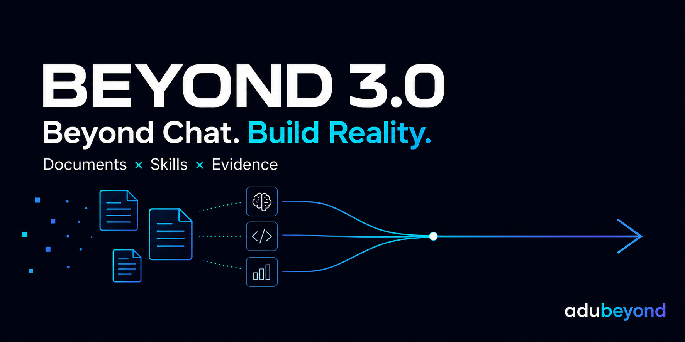
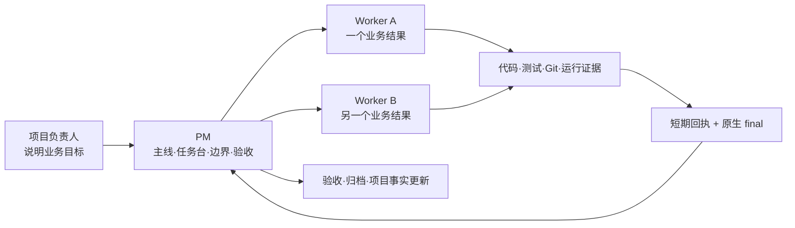

# BEYOND

[English](README.md) | **简体中文**



> **Beyond Chat. Build Reality.**
> 让 Codex 不只回答问题，而是持续完成真实项目目标。

BEYOND 是面向 **Codex Desktop 本地项目**的开源 AI 项目协作系统，让 AI 不只完成一次对话，而是围绕真实目标组织、推进和交付工作。PM 理解项目、分析需求与技术问题、安排任务并检查结果；执行者在同一任务中连续完成设计、开发、测试和已授权的运维工作。

它既支持一个 PM 管理全局，也支持多个 PM 分管不同方向。在用户启用模型策略后，PM 能按任务自动选择模型与推理强度组合，遇到难题升档、难点解决后按剩余工作降档，保留同一执行者的上下文和成果。配合项目知识留存、按需读取、任务回传、暂停恢复和结果验收，BEYOND 希望减少反复交代背景、手动催进度和不必要的返工。

它适合已经在用 Codex 做真实开发，但正在被这些问题困扰的人：新对话反复失忆、任务完成后无人收口、阶段过多需要人工续推、测试通过却无法判断能否发布，以及多个任务并行时责任和写入边界混乱。

[下载 BEYOND v3.2.11](https://github.com/adubeyond/beyond-ai-collaboration/releases/tag/v3.2.11) · [Gitee 镜像](https://gitee.com/adubeyond/beyond-ai-collaboration) · [90 秒真实案例](docs/真实案例与90秒演示.md) · [安装指南](模板交付包/docs/安装升级与项目初始化指南.md) · [快速开始](docs/快速开始.md) · [3.2.11 升级说明](docs/releases/v3.2.11.md) · [系统架构](docs/系统架构与运行机制.md)

## BEYOND 带来什么

| 真实问题 | BEYOND 的处理 |
| --- | --- |
| 新对话不知道项目做到哪里 | 项目目标、当前主线、任务台和长期事实保存在项目内控制仓 |
| PM 派完任务后需要不断等待、轮询和催促 | Worker 完成或暂停时保存短期回执并原生回调；PM被唤醒后统一验收 |
| 设计、开发、测试、运维被拆成多轮人工接力 | 一个业务结果由同一 Worker连续推进，动作能力按需要切换 |
| 提示词越短，AI越容易被规则拖入长路径 | 当前明确指令优先于BEYOND默认偏好；目标清晰直接执行，真正歧义才询问 |
| 测试通过、允许改文件、允许提交和允许发布被混为一谈 | 文件、Git、网络、服务器、数据和生产权限分别判断 |
| 多个任务并行时互相覆盖或重复验收 | PM登记唯一Worker和写入边界；同一结果只验收、归档一次 |

## 3.2.11 的核心能力

### 1. 按任务选模型，按阶段升降档

不是所有工作都用最贵的模型，也不是一律从最低档开始试。用户启用模型策略后，PM 根据任务难度、已有方案和实际交付证据选择组合，以 Sol 为主力，不把通用跑分当成任务完成度。

3.2.11 保留现有模型分布和线程设置，重点纠正阶段交付后停工、重复确认往返，以及回调处理挤占当前问题；旧发布包保持原样。

| 当前工作 | 推荐起点 |
| --- | --- |
| PM 的项目判断与推进 | GPT-6.1 Sol · 极高（`xhigh`），由用户设置 PM |
| 常规开发、修复、文档与一般方案 | GPT-6.1 Sol · 高（`high`） |
| 难任务、复杂排障、跨模块设计或直接高后果工作 | GPT-6.1 Sol · 极高（`xhigh`）；普通 UI 不一律升档 |
| 规则明确的批量提取、分类、格式转换与重复处理 | GPT-6 Luna · 高（`high`） |
| Sol 出现明确推理瓶颈，或用户指定的攻坚 | GPT-6 Astra；强度按任务选择，不作为常规或难任务默认 |

当前源码只提供 `beyond-worker-gpt61-v5` 与平台默认。旧矩阵（含 v4）留在 Git 历史，不再作为运行选项；升级可以识别旧批准，但需用户明确选择当前矩阵才启用，不擅自更改正在运行的任务或原线程配置。`v5` 是模型策略标识，不是产品发布版本号。

PM 在同一执行者回合结束后的正常续接点升降档：先补齐事实与指导，再判断是否有推理瓶颈；难点解决、剩余工作变简单后可以降档。不要求试遍低档，不为省额度中断正常工作。模型与推理强度成对传递，避免继承 PM 或上一阶段的强度。发送参数只代表请求被接受，实际配置未返回时不声称已生效。

**优先顺序是完整正确交付、总完成时间、再考虑额度。** 成本包含返工；这套默认依据用户实际对照反馈，不是最佳配置保证、模型跑分或固定节省比例。默认不是硬上限或最低档，可据任务证据升降组合；授权与验收不因选档放松。未启用时保留平台设置，Worker 策略不改变 PM 自身配置。用户锁定、预算与实际平台支持优先。

### 2. 有判断力的 PM，单人总管或多人分管

PM 不只是任务转发器：它结合项目全貌澄清真正目标，进行产品与技术判断，把简短需求整理成结果、边界和验收要求。执行者方向偏了，PM 应指出原目标的缺口并指导继续，而不是只拒绝完成后停住。

小项目可由一个 PM 管理全局；大项目可由多个 PM 在共同理解整体目标的基础上分管不同方向。独立结果可以并行，真实依赖直接协调；每个结果仍有明确负责人和唯一正式执行者，不另造一层总控或要求用户来回传话。

### 3. 一个执行者，把一个结果连续做完

设计、开发、测试和运维是按问题选择的专业方法，不是四个必须人工接力的阶段。普通报错、修复和复测在原任务中继续；检查点、返工和补证保留原执行者，不反复创建新对话。

执行回合结束但任务未完时，执行者回报已做内容、剩余目标和下一步；PM 在原授权范围内指导继续。只有真实业务取舍、额外高风险授权、无法自行解决的共享冲突或必要外部资源缺失才暂停，补齐条件后由原执行者恢复。

### 4. 项目知识可复用，背景按需要提供

目标、架构、开发约定、测试方法、运行入口和用户纠偏沉淀到有明确来源的项目资料。新 PM 接手先了解项目全貌；执行者读取与自己任务相关的事实，不把全项目文档塞进每个任务。

资料可以保留原路径并登记入口，不必全部搬家。旧文档与现场冲突时要核对当前事实，不能把历史描述当作新的执行依据；缺少资料但能安全调查时，先调查，不制造额外文档门槛。

### 5. 回传、核验、恢复形成任务闭环

完成或真实暂停时，执行者保存短期回执并回传 PM；PM 核对本轮是否结束、正式结果和验收证据，再更新工作台并清除已处理回执。重复通知不会重复验收。用户明确取消的任务可以关闭并保留历史，不冒充完成。

PM 忙碌时在安全工具边界处理已注入回调，然后继续原用户请求，最终保留前台回答与后台结果。针对回传和正文可见性的时间差，提供最长一分钟的有界等待，以及严格限定身份和当前回合的本机只读补读；宿主没有启动处理回合时，可在下一次自然 PM 回合补读待处理结果。这些是恢复路径，不是永不漏回传的保证。

### 6. 可选 CLI 协作，保留同一会话形成目标循环

保留原生 Desktop Worker 主链，另外支持“PM → Worker → CLI”和“PM 或 Worker → CLI”两条可选路径。3.2.10可打开真正的原生CLI交互窗口，看到执行过程、输入补充要求并续接同一会话，不把JSON日志冒充聊天。CLI在指定项目和授权范围内执行；一轮结束且负责人前台回答结束后通知负责人，核验后继续或验收，不需要一直陪跑。

通知只表示该轮结束，不等于业务目标完成。直接 CLI 任务有独立结果与验收记录，不伪装成 Desktop Worker 回执；经 Worker 调用时，仍由原 Worker 按原协议向 PM 交付。支持失败恢复、并发隔离、重复通知抑制和目标变更后的明确关闭。第三方 API 的模型、配置与认证由本机 CLI 配置提供，不绑定或冒用 Codex 订阅，也不把凭据放入安装包。

### 7. 轻量接入，保留真实边界

通过项目入口、六个 Skills 和本地控制脚本工作，不新增常驻守护进程、Hook 或第二套任务调度器。支持非 Git 项目、单仓、多仓和平台已提供的工作树；项目身份与执行位置分别核对，避免把结果写入错误控制仓。

用户当前明确的目标和授权优先于普通流程偏好。工具按实际任务选择，不把命令行或浏览器变成唯一道路；同时不把“允许改代码”扩大成“允许操作生产”。安装只替换清单内产品内容，保留项目资料和运行状态；外置校验文件可选，已提供但不一致时仍须停止。

## 它怎样工作


```mermaid
flowchart LR
    U["项目负责人\n说明业务目标"] --> PM["PM\n主线·任务台·边界·验收"]
    PM --> W1["Worker A\n一个业务结果"]
    PM --> W2["Worker B\n另一个业务结果"]
    W1 --> E["代码·测试·Git·运行证据"]
    W2 --> E
    E --> R["短期回执 + 原生 final"]
    R --> PM
    PM --> S["验收·归档·项目事实更新"]
```

PM负责理解目标、分析问题、设计任务和纠偏，不只是转发任务，也不会为了“掌控进度”持续轮询Worker。Worker连续完成授权范围内的工作；如果执行回合结束但任务未完，向来源PM回报尚未完成的结果，PM按原授权指导同一Worker继续。正常完成或真实暂停时，Worker冻结final、保存短期回执、执行一次回调；PM核对本轮结束状态、正式结果和证据后收口。回调到达不等于Worker已经结束。

## 三步开始

### 1. 下载正式版本

- [BEYOND-3.2.11.zip](https://github.com/adubeyond/beyond-ai-collaboration/releases/download/v3.2.11/BEYOND-3.2.11.zip)
- [BEYOND-3.2.11.zip.sha256（可选校验文件）](https://github.com/adubeyond/beyond-ai-collaboration/releases/download/v3.2.11/BEYOND-3.2.11.zip.sha256)

ZIP即可安装；`.sha256`缺失或下载失败不阻断安装。若提供了校验文件而哈希不一致，则必须停止。完整命令见[安装、升级与项目初始化指南](模板交付包/docs/安装升级与项目初始化指南.md)。

### 2. 让 Codex 完成安装

在目标项目的新普通对话中发送下面这段话，不调用身份Skill：

```text
这是BEYOND安装维护请求，不建立PM、Worker或业务任务。
请使用我已下载并验真通过的BEYOND 3.2.11正式发布包，安装或升级当前项目的beyond-control和六个全局Skill。
先精确备份；保留项目原生规则以及local、projects、shared中的真实内容，不用空模板覆盖。
完成项目入口融合和安装验真后停止，等待我重启Codex。不要启动、恢复或修改业务任务。
```

安装会写入项目根的`beyond-control/`、融合根`AGENTS.md`，并安装六个用户级Skills：

```text
identity-pm      identity-worker
task-design      task-dev
task-test        task-ops
```

BEYOND 3.2.11不安装身份Hook、notify分支、常驻守护进程或额外Codex CLI。可选CLI路径使用本机已有CLI，按次启动有限生命周期后台执行与通知，不替换默认Desktop主链。

### 3. 重启并接手项目

替换全局Skill后重启Codex。在项目根新建对话：

```text
$identity-pm
使用 BEYOND 初始化这个新项目。
```

已有项目改为：

```text
$identity-pm
使用 BEYOND 接入或升级这个已有项目。
```

最低接入后，你可以选择立即完整初始化，或先开始使用、以后按需补齐。BEYOND不会要求空白项目先编造服务器、部署或业务事实。

## 一个真实任务是什么样

```text
$identity-pm

目标：为订单模块增加批量导出，并在测试环境验证导出文件可下载。
明确不做：不修改生产数据，不发布生产。
验收：现有测试通过；新增导出测试通过；测试环境取得一次真实下载证据。
权限：允许修改代码、运行测试、创建本地提交并部署测试环境；不允许推送或生产发布。

请登记一个正式任务，由唯一Worker连续完成需要的设计、开发、测试和测试环境验证。
```

目标已经清楚时，PM直接登记并派发；Worker不会把设计、开发、测试拆成需要你反复输入“继续”的多个结果。普通失败在原任务中修复回测，真正缺少业务决定或高风险授权时才暂停。

## 适合与不适合

适合：

- 独立开发者、一人公司和小团队，用 Codex长期维护真实项目；
- 同时推进多个功能、缺陷、数据、运维或发布任务；
- 需要项目记忆、任务恢复、权限分离和证据验收；
- 希望AI少走流程、少靠人工续推，但仍能守住生产边界。

暂不适合：

- 只做一次性问答、文案或无需项目状态的简单请求；
- 不支持项目任务、Skills和线程回调的平台；
- 希望AI在没有明确授权、目标环境或回滚条件时自动操作生产系统。

## 当前边界

- 当前正式版本是`v3.2.11`，主要面向Codex Desktop本地项目。
- 标准安装与运行路径已在真实Windows项目中验证；公开脚本同时覆盖内容、安装结构和最小示例。
- 不同平台对任务创建、线程回调和持久权限的支持不同，不能把一个平台的通过结论外推到所有环境。
- 保留已结束但平台正文不可读时的本机只读补读；不保证所有宿主版本兼容，也不宣称彻底解决长上下文中的目标漂移。
- BEYOND不收集安装遥测；GitHub Release下载量只能统计发布资产下载，不能代表全部安装或实际活跃用户。

## 文档入口

| 想做什么 | 从这里开始 |
| --- | --- |
| 看一次真实完成与暂停恢复 | [真实案例与 90 秒演示](docs/真实案例与90秒演示.md) |
| 安装、升级或回退 | [安装、升级与项目初始化指南](模板交付包/docs/安装升级与项目初始化指南.md) |
| 在干净示例中体验 | [快速开始](docs/快速开始.md) |
| 理解PM、Worker、文档和运行时 | [系统架构与运行机制](docs/系统架构与运行机制.md) |
| 查看3.2.11变化 | [升级说明](docs/releases/v3.2.11.md) · [CHANGELOG](CHANGELOG.md) |
| 阅读控制仓结构 | [模板交付包说明](模板交付包/README.md) |
| 提交问题或改进 | [Issues](https://github.com/adubeyond/beyond-ai-collaboration/issues) · [贡献指南](CONTRIBUTING.md) |
| 私密报告安全问题 | [安全政策](SECURITY.md) |

## 开源与维护

BEYOND 使用 [Apache License 2.0](LICENSE)。Issue与PR需要经过公开验证和人工审查；测试通过不等于自动采纳。

由 [adubeyond](https://github.com/adubeyond) 创建并维护。

`adubeyond · Creator of BEYOND`

> **超越对话，抵达结果。**
