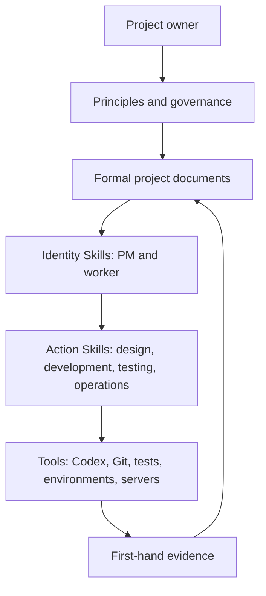
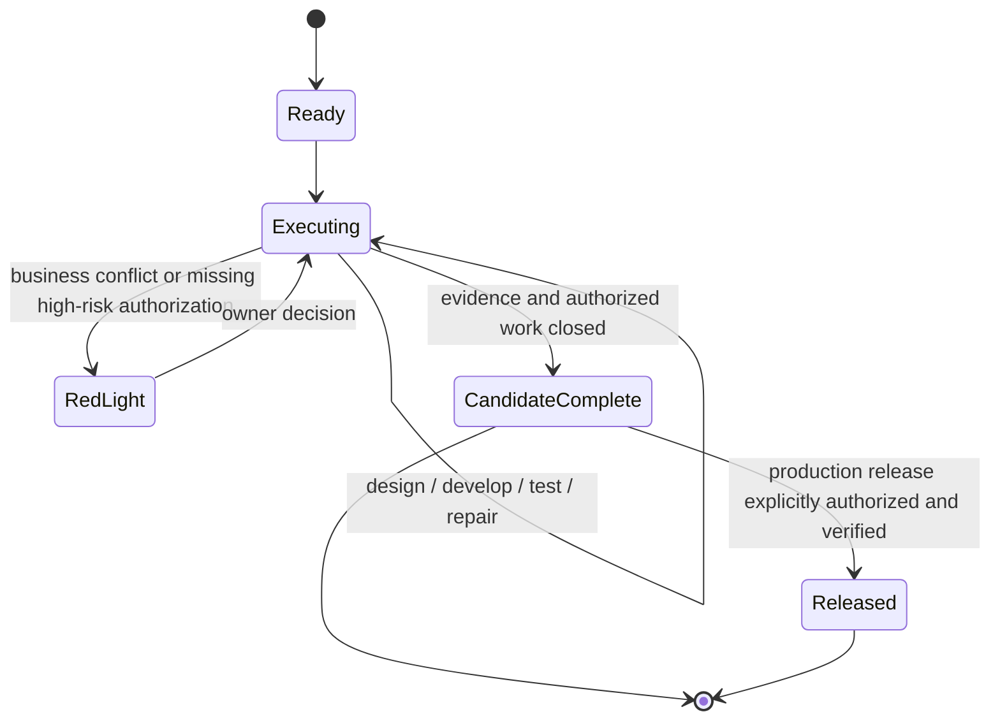

# BEYOND 3.0 Architecture Overview

**English** | [简体中文完整版](../系统架构与运行机制.md)

BEYOND is a document-driven control system around Codex. Formal documents preserve project truth, Skills preserve reusable operating methods, and tools provide first-hand execution reality.

## System layers



| Layer | Responsibility |
| --- | --- |
| Project owner | Business direction, meaningful trade-offs, and high-risk authorization |
| PM control plane | Portfolio state, complete task contracts, task isolation, red-light decisions, and closure |
| Worker control instance | The complete lifecycle of one business task |
| Action Skills | Professional methods required by the current task phase |
| Formal documents | Objectives, boundaries, state, project capabilities, evidence, and history |
| Tools and environments | Current code, Git, tests, services, data, server, and production reality |

## One business result, one control instance

A business result is not split into four independent design, development, testing, and operations owners. The PM creates one formal task. One worker becomes its task-control instance and switches actions as required.



Ordinary failures do not become PM decisions. The worker repairs and retests within the existing task authorization. A red light is reserved for issues that genuinely change business meaning, authorization, irreversible risk, or cross-task ownership.

## Document truth and write-back

BEYOND separates documents by ownership and update frequency:

- The root entry routes Codex to the minimum valid read path.
- The project overview stores stable objectives, boundaries, and capability status.
- The PM-owned workbench stores current portfolio control state.
- A formal task stores one business result, contract, evidence index, and terminal state.
- Project-fact baselines store verified engineering, design, testing, operations, and security knowledge.
- Historical records preserve completed context without becoming current authority.

Newly verified facts return to their formal owner. Workers do not directly edit PM-only control state; they send lifecycle or shared-fact events, and the PM updates its control view. This allows several tasks to run concurrently without sharing one ambiguous conversation state.

## Authorization and truth

The following permissions and truths are independent:

- Reading files does not authorize writing them.
- Writing files does not authorize Git staging, commit, push, or merge.
- Passing tests does not authorize deployment.
- Deployment access does not authorize destructive data changes.
- A document claim does not override current code, Git, environment, or production evidence.

When sources conflict, BEYOND records the conflict and uses the freshest authoritative evidence for the relevant domain. It does not silently choose the most convenient statement.

## Growing project capability

The first time an action lacks essential project facts, the Skill guides a minimal initialization: discover what can be verified, ask only for facts that cannot be discovered, write the baseline, and continue the original task. Later tasks reuse that baseline and refresh it only when a real trigger appears.

This creates a learning loop:

```text
task → investigation → verified fact → formal baseline → later reuse → conditional refresh
```

The full Chinese architecture document covers detailed read chains, ownership matrices, lifecycle events, multi-task convergence, source-of-truth conflicts, and capability initialization: [系统架构与运行机制](../系统架构与运行机制.md).
