# BEYOND 3.1 Quick Start

This page is for the minimal fixture. For real-project installation, upgrades, Hook review, new/existing-project initialization, and copy-ready prompts, use the [Installation, Upgrade, and Project Initialization Guide](../../模板交付包/docs/en/installation-upgrade-and-project-initialization.md) instead of assembling an adoption sequence from this example.

**English** | [简体中文](../快速开始.md)

This guide uses the repository's zero-dependency Node.js fixture to verify three things:

1. The template can enter a clean project.
2. Codex can understand the project through a fused root `AGENTS.md` and the external document chain.
3. One clear development task can move through design, development, testing, evidence, and write-back without repeated stage routing.

The guide does not touch a real server, database, production environment, or remote Git repository.

## Requirements

- A Codex environment that can read project `AGENTS.md` files and use Skills.
- Node.js 18 or later. The fixture uses only built-in modules and needs no `npm install`.
- A writable local directory.

If you want to invoke `$identity-pm`, `$identity-worker`, and `$task-*` directly, install the six Skills from this repository and restart Codex. If they are not installed, explicitly reference their project-local `SKILL.md` paths.

Confirm the environment:

```text
node --version
npm --version
```

## Prepare the demo project

Copy [`examples/minimal-project`](../../examples/minimal-project) to a new writable directory such as `beyond-demo`.

Copy the complete [control-repository package](../../模板交付包) into the demo root and name it `beyond-control`. Keep it as one independent directory instead of scattering BEYOND files across the business project:

```text
workspace/
beyond-demo/
├─ beyond-control/
└─ <existing code and documents>
```

Initialize the control repository, inspect the business project, and install the fused project entry only after explicitly confirming BEYOND-led fusion:

```text
cd beyond-demo
node beyond-control/scripts/beyond-control.mjs init-control --project-root "."
node beyond-control/scripts/beyond-control.mjs inspect-project --project-root "."
node beyond-control/scripts/beyond-control.mjs install-project-entry --project-root "." --confirm-fusion yes
```

Existing-project inspection prioritizes formal documents, legacy workbenches, nested repositories, and duplicate remotes. If active legacy tasks exist, add `--adopt-legacy-workbench yes`; if the same remote has multiple local directories, select exactly one path per duplicate-remote group with `--canonical-repositories "<path1>,<path2>"`. The script will not silently replace those facts with an empty workbench.

The business project receives the fused root `AGENTS.md` and project-level `.codex` guard. BEYOND documents and project registration remain in the project-local control repository; the personal workbench is under its Git-ignored `local/`. When the project root is a Git repository, initialization also ignores `/beyond-control/` and `/.beyond-local-backups/` there so neither the independent control repository nor local backups are accidentally staged as business code. Empty project facts are expected and must not be filled with guesses.

Local fusion does not push automatically. The fixed script creates a shared project record, a minimal project overview, and a minimal facts index so the fused entry is immediately reachable. If teammates need them, authorize remote Git separately, then use the `project-registration` scope to push only these three foundation files for the same project.

An unadopted project does not yet have the BEYOND root entry. Start with `$identity-pm`, then use `Use BEYOND to initialize this new project.` or `Use BEYOND to adopt or upgrade this existing project.` Inspect code, Git, `AGENTS.md`, and Markdown first for an existing project, then ask the user to confirm each fusion or migration group. Do not overwrite or delete the original documentation tree automatically. This compatibility check is not part of the normal task hot path.

## Install the Skills

Install or explicitly reference these six directories from `beyond-control/skills/`:

```text
identity-pm
identity-worker
task-design
task-dev
task-test
task-ops
```

From the business-project root, start Codex CLI and enter `/hooks` to review and trust the project Hook. Project trust and Hook-definition trust are separate. Then run this fixed command from a Codex project task:

```text
node beyond-control/scripts/beyond-control.mjs hook-probe --project-root "<business project root>"
```

Before restarting Codex, verify the actual installed copy from the immutable release checkout:

```text
node beyond-control/scripts/verify-install-integrity.mjs --installed-skills-root "<Codex Skills directory>" --project-agents "<business project root>/AGENTS.md"
```

Installation or upgrade is complete only when this command exits with code `0` and confirms that all six Skills, the control-repository structure, the full project runtime kernel, and the real Hook probe match. `--content-only` checks files but does not prove that Codex executed the Hook. If `/hooks` is unavailable or the probe still fails after trust, record `codex --version` and `codex features list` and report a compatibility gap instead of searching for an undocumented Desktop menu. Restart Codex only after verification, then create a new task from the demo root.

## Run the initial baseline

From the demo root:

```text
npm test
npm run check
```

Expected result:

- `npm test` passes the existing `add` test.
- `npm run check` passes syntax checks for source and test files.
- No `node_modules` or lockfile is created.

If the baseline fails, repair the Node.js environment or fixture first. Do not report a pre-existing baseline failure as a development regression.

## Start the PM and assign the first task

Send this message in a new Codex task opened at the demo root:

```text
$identity-pm Take control of the current project as the PM.

This is the minimal calculator project used to verify BEYOND.
Business result: add subtract(left, right) to src/calc.js and add a test proving subtract(5, 2) === 3 in test/calc.test.js.
Explicit non-goals: do not add multiplication, division, a command-line interface, dependencies, or unrelated files; do not use Git; do not deploy.
Allowed actions: read the current project; modify src/calc.js, test/calc.test.js, and the project documents defined by the template; run npm test and npm run check.
Acceptance: both commands exit with code 0, the existing add test still passes, and the new subtract test passes.

Follow the minimum read path in the root AGENTS.md. Record one task in the workbench and create one Worker with the six-field task packet. The Worker must remain responsible for the result and combine design, development, and testing as needed. Return the formal result and current-run evidence to the PM. Write reusable engineering facts only when the task actually confirms them; do not create a capability-initialization task.
```

The message deliberately supplies the business result, non-goals, file boundary, command permissions, and acceptance criteria. It tests the complete automatic path rather than the PM's ability to ask many questions.

## Expected flow

```mermaid
flowchart LR
    A["PM minimum read"] --> B["Record task in workbench"]
    B --> C["Create Worker with six-field packet"]
    C --> D["Worker reads relevant project facts"]
    D --> E["Implement subtract and its test"]
    E --> F["npm test"]
    F -->|"failed"| E
    F -->|"passed"| G["npm run check"]
    G -->|"passed"| H["Formal result and current evidence"]
    H --> I["PM accepts and updates workbench"]
```



Normal behavior:

- The PM does not modify `src/calc.js` or the test file.
- Design, development, and testing are not split into three business tasks that require repeated “continue” messages.
- Missing project facts do not block unrelated work. The Worker writes reusable facts in the original task only when they are actually confirmed.
- Ordinary implementation or test failures are repaired and retested in the same task.
- Git, dependencies, servers, production, and data remain untouched because they were not authorized.

## Verify the result

Run again:

```text
npm test
npm run check
```

Also verify:

- `src/calc.js` exports both `add` and `subtract`.
- `test/calc.test.js` covers `add(2, 3) === 5` and `subtract(5, 2) === 3`.
- The PM workbench records one formal task, its Worker, progress, and completion instead of doing the implementation itself.
- The formal task contains implementation, current-run validation, and completion evidence.
- Project documents contain only investigated or verified facts.
- Git, services, network, servers, production, and data show zero operations.

For a second run, keep the control repository, delete only the disposable demo directory, create a fresh fixture copy, and fuse its project entry again. Do not force-clean a directory containing personal work, and do not copy runtime facts back into this repository's original fixture.

Continue with the [Architecture Overview](architecture.md) before adopting BEYOND in a real project.
