# BEYOND 3.0 Quick Start

**English** | [简体中文](../快速开始.md)

This guide uses the repository's zero-dependency Node.js fixture to verify three things:

1. The template can enter a clean project.
2. Codex can understand the project through the root `AGENTS.md` and the minimum document chain.
3. One clear development task can move through design, development, testing, evidence, and write-back without repeated stage routing.

The guide does not touch a real server, database, production environment, or remote Git repository.

> Check the capability boundary first: loading `AGENTS.md` and Skills is not the same as running complete formal-task collaboration. This version supports Windows + Codex Desktop only. PM-to-worker routing also requires the current Desktop session to expose user-visible task creation, follow-up messaging, task reading, and direct correction. If any capability is missing, do not present an internal subagent as a formal task.

## Requirements

- Codex Desktop on Windows, able to read project `AGENTS.md` files and use Skills. Complete collaboration additionally requires the current session to expose the formal-task capabilities.
- Node.js 24.x, the current tested script-runtime baseline. The fixture uses only built-in modules and needs no `npm install`.
- A writable local directory.

If you want to invoke `$identity-pm`, `$identity-worker`, and `$task-*` directly, install the six Skills from this repository and restart Codex. If they are not installed, explicitly reference their project-local `SKILL.md` paths.

Confirm the environment:

```text
node --version
npm --version
```

## Prepare the demo project

Copy [`examples/minimal-project`](../../examples/minimal-project) to a new writable directory such as `beyond-demo`. From this repository root, inspect the dry-run and then install into that explicit target:

```text
node scripts/beyond-install.mjs install --target <absolute-demo-path> --dry-run
node scripts/beyond-install.mjs install --target <absolute-demo-path>
node scripts/beyond-install.mjs version --target <absolute-demo-path>
node scripts/beyond-install.mjs verify --target <absolute-demo-path>
```

The manager owns only `AGENTS.md`, `docs/AI编程协同机制/`, and project-local `skills/`; it does not overwrite the fixture README. It stops on a colliding file, drift, symbolic link, or path escape.

Keep the fixture's own `README.md`; do not overwrite it with the template package README. The result should contain at least:

```text
beyond-demo/
├─ AGENTS.md
├─ README.md
├─ package.json
├─ docs/AI编程协同机制/
├─ skills/
├─ src/calc.js
└─ test/calc.test.js
```

The project overview, workbench, and project facts are intentionally uninitialized. Do not prefill them with demo results.

## Install the Skills

The project-template manager never writes to a real Codex runtime directory. Explicitly reference project-local Skill paths when the surface supports that. To use the `$identity-*` and `$task-*` entries, install these six directories through the current Codex-supported Skill installation path and restart Codex:

```text
identity-pm
identity-worker
task-design
task-dev
task-test
task-ops
```

Runtime Skill installation is outside this manager's write scope. Restart Codex after that separate installation, then create a new Codex task from the demo root.

## Run the initial baseline

From the demo root:

```text
npm test
npm run check
```

Expected result:

- `npm test` passes the existing `add` test.
- `npm run check` passes syntax checks for source and test files.
- No `node_modules` or lockfile is created.

If the baseline fails, repair the Node.js environment or fixture first. Do not report a pre-existing baseline failure as a development regression.

## Start the PM and assign the first task

Send this message in a new Codex task opened at the demo root:

```text
$identity-pm Take control of the current project as the PM.

This is the minimal calculator project used to verify BEYOND.
Business result: add subtract(left, right) to src/calc.js and add a test proving subtract(5, 2) === 3 in test/calc.test.js.
Explicit non-goals: do not add multiplication, division, a command-line interface, dependencies, or unrelated files; do not use Git; do not deploy.
Allowed actions: read the current project; modify src/calc.js, test/calc.test.js, and the project documents defined by the template; run npm test and npm run check.
Acceptance: both commands exit with code 0, the existing add test still passes, and the new subtract test passes.

Follow the minimum read path in the root AGENTS.md. Investigate facts available from package.json, source, and tests; complete only the project initialization required for this task; form a complete task contract and create one formal task. The worker must remain the single task-control instance and combine design, development, and testing as needed. Write back the evidence and one terminal event when complete.
```

The message deliberately supplies the business result, non-goals, file boundary, command permissions, and acceptance criteria. It tests the complete automatic path rather than the PM's ability to ask many questions.

## Expected flow

```mermaid
flowchart LR
    A["PM minimum read"] --> B["Inspect package, source, and tests"]
    B --> C["Freeze contract and create formal task"]
    C --> D["Worker becomes task controller"]
    D --> E["Implement subtract and its test"]
    E --> F["npm test"]
    F -->|"failed"| E
    F -->|"passed"| G["npm run check"]
    G -->|"passed"| H["Evidence, write-back, terminal event"]
    H --> I["PM consumes and closes"]
```



Normal behavior:

- The PM does not modify `src/calc.js` or the test file.
- Design, development, and testing are not split into three business tasks that require repeated “continue” messages.
- If required project facts are missing, the worker investigates and writes the minimum baseline, then continues the original task.
- Ordinary implementation or test failures are repaired and retested in the same task.
- Git, dependencies, servers, production, and data remain untouched because they were not authorized.

## Verify the result

Run again:

```text
npm test
npm run check
```

Also verify:

- `src/calc.js` exports both `add` and `subtract`.
- `test/calc.test.js` covers `add(2, 3) === 5` and `subtract(5, 2) === 3`.
- The PM task records one formal task and its terminal state instead of doing the implementation itself.
- The formal task contains implementation, current-run validation, and completion evidence.
- Project documents contain only investigated or verified facts.
- Git, services, network, servers, production, and data show zero operations.

Before an upgrade, run `verify`, then run `upgrade --dry-run` and `upgrade` from the new source checkout. A successful upgrade reports a backup ID with raw-byte hashes. Roll back with `rollback --backup <id> --dry-run` followed by the same command without `--dry-run`; rollback refuses a drifted managed tree.

For a second run, delete only the disposable demo directory, create a fresh copy of the original fixture, install the template again, restart Codex, and repeat the baseline. Do not force-clean a directory containing personal work, and do not copy runtime facts back into this repository's original fixture.

Continue with the [Architecture Overview](architecture.md) before adopting BEYOND in a real project.
