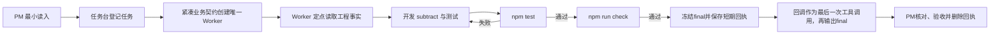

# BEYOND 3.2.4 快速开始

本页用于最小示例体验。真实项目首次安装、版本升级、新/老项目初始化及可复制提示词统一见[安装、升级与项目初始化指南](../模板交付包/docs/安装升级与项目初始化指南.md)，不要从本页拼接一套生产接入顺序。

本指南使用仓库中的零第三方依赖 Node.js 示例，验证三件事：

1. BEYOND控制仓能够在干净业务项目根下独立建立。
2. Codex 能按融合后的根`AGENTS.md`和项目内控制文档链理解项目。
3. 一个清晰开发任务能够沿设计/开发/测试路径完成，并留下当前轮证据。

这不是模板全部能力的压力测试，也不涉及真实服务器、生产发布、数据库或远端 Git。

## 1. 前置条件

- 已安装可以读取项目`AGENTS.md`并使用 Skills 的 Codex 环境。
- 已安装 Node.js 18 或更高版本；示例只使用 Node.js 内置模块，不需要`npm install`。
- 有一个可写的本地目录。
- 如果要直接使用`$identity-pm`、`$identity-worker`和`$task-*`，需要先安装本仓库的六个Skills。首次安装或替换全局Skill后必须重启Codex；只显式引用项目内`SKILL.md`且全局Skill没有变化时不需要为形式重启。

先确认环境：

```text
node --version
npm --version
```

## 2. 准备示例项目

复制[最小示例](../examples/minimal-project)到一个新的可写目录，例如`beyond-demo`。

把[模板交付包](../模板交付包)完整复制到示例项目根下，并命名为`beyond-control`。不要把交付包内容散着覆盖业务项目：

```text
beyond-demo/
├─ beyond-control/
└─ <原有代码与文档>
```

在控制仓初始化目录，并在明确同意以 BEYOND为主融合项目入口后接入示例：

```text
cd beyond-demo
node beyond-control/scripts/beyond-control.mjs init-control --project-root "."
node beyond-control/scripts/beyond-control.mjs inspect-project --project-root "."
node beyond-control/scripts/beyond-control.mjs install-project-entry --project-root "." --confirm-fusion yes
```

旧项目检查会优先列出正式文档、旧工作台、子仓库和重复remote。存在活动旧任务时必须增加`--adopt-legacy-workbench yes`；同一remote有多个本地目录时先人工选择每组唯一正式路径，再用`--canonical-repositories "<路径1>,<路径2>"`登记。脚本不会用空工作台覆盖这些事实。

单根同目录项目可以使用上面的最短命令。跨根、多仓或需要兼容平台既有worktree时，还必须从当前Codex项目现场取得真实主机与平台项目编号，在首次融合时增加`--host-id "<当前hostId>" --codex-project-id "<当前Codex projectId>"`；缺少这两个字段时，完整验真会拒绝把多仓登记宣称为可执行。额外正式Git根用`--repository-roots`登记。后续升级会保留既有外部仓和这两个平台绑定，不要求每次重复输入；若仓路径、精确Git根或origin remote已经漂移，固定入口停止覆盖并要求显式裁决。

完成后，示例项目新增融合后的根`AGENTS.md`。已有第三方Hook不会被覆盖；若存在BEYOND旧身份护栏，固定脚本只移除BEYOND处理器和护栏文件。BEYOND正式文档和项目登记位于项目内独立控制仓，个人工作台位于控制仓`local/`且不会进入Git；项目根Git也会忽略`/beyond-control/`和`/.beyond-local-backups/`，避免把独立控制仓或本机备份误收为业务代码。项目总览和项目事实最初为空是预期状态，不要提前伪造结论。

本地融合不自动推送。固定脚本会建立共享项目登记、最小项目总览和最小事实索引；确需让其他成员复用时，用户另行授权远端Git，再用`project-registration`范围精确推送同一项目的这三份基础文件。

## 3. 安装或显式引用 Skills

推荐把`beyond-control/skills/`下六个目录安装到当前 Codex 的 Skills 目录：

```text
identity-pm
identity-worker
task-design
task-dev
task-test
task-ops
```

安装完成后，从取得的不可变版本运行安装验真：

```text
node beyond-control/scripts/verify-install-integrity.mjs --installed-skills-root "<Codex Skills目录>" --project-agents "<业务项目根>/AGENTS.md"
```

只有退出码为`0`并明确显示六个Skill、控制仓结构和项目运行内核一致，且没有BEYOND旧Hook残留，才算磁盘安装完成。`--content-only`只核对候选内容，不证明项目已经融合。首次安装或替换全局Skill后重启Codex，再从示例项目根目录创建新任务。具体入口见[控制仓交付包说明](../模板交付包/README.md)。

## 4. 运行初始基线

在示例项目根目录运行：

```text
npm test
npm run check
```

预期结果：

- `npm test`通过一个`add`测试。
- `npm run check`对源码和测试文件完成语法检查。
- 不生成`node_modules`或锁文件。

如果初始基线失败，先解决 Node.js 环境或示例文件问题，不要把基线失败当成后续开发回归。

## 5. 启动 PM 并下达第一个任务

在示例项目的新 Codex 任务中输入：

```text
$identity-pm 以 PM 总控身份接手当前项目。

这是一个用于验证 BEYOND 的最小计算器项目。
当前业务结果：为 src/calc.js 增加 subtract(left, right)，并在 test/calc.test.js 增加 subtract(5, 2) === 3 的测试。
明确不做：不增加乘法、除法、命令行界面、第三方依赖或其他文件；不执行 Git；不发布。
允许：读取当前项目，修改 src/calc.js、test/calc.test.js，并在确实形成稳定事实时更新控制仓中的对应项目文档；运行 npm test 与 npm run check。
验收：两个命令退出码均为 0，现有 add 测试继续通过，新 subtract 测试通过。

请先按根 AGENTS.md 的最小读入链判断当前项目；在当前工作台登记一个正式任务，用紧凑业务契约创建全新、绑定正式项目的唯一 Worker。由 Worker在同一任务中按需要组合设计、开发和测试，完成后把正式结果和当前轮证据回给 PM。当前任务确认了后续会复用的工程事实时再写入项目事实，不建立能力初始化任务。
```

这段输入故意一次给足业务结果、明确不做、文件边界、命令权限和验收，目的是验证完整任务自动路径，而不是测试 PM 会问多少问题。

## 6. 预期运行过程



正常情况下：

- PM 不应亲自修改`src/calc.js`或测试文件。
- 设计、开发和测试不应被拆成三个需要用户逐次说“继续”的业务任务。
- 项目事实缺失但不影响当前任务时不阻塞；确认了可复用事实时，Worker在原任务中补齐。
- 普通实现或测试失败应在原任务内修复回测。
- 未授权的 Git、依赖安装、服务器、生产和数据操作不得发生。

### 3.2.4 的执行判断

- 当前指令已经给出明确结果、边界和验收时，PM与Worker直接沿最短可行路径完成，不为BEYOND默认偏好重复询问或增加阶段。
- “优化一下”“处理一下”这类输入会产生不同业务结果时，先问一个真正改变实现的问题；能够从项目现场查明的技术细节先调查，不转交用户补齐。
- 用户当前明确授权可以覆盖CLI或网页等普通执行偏好，但不能被扩大为未授权的凭据、生产、共享数据或破坏性操作。
- 同等能力下优先使用命令行；只有用户明确要求网页，或任务依赖已有浏览器登录态、扩展和可视状态时才使用浏览器。
- PM把同一业务目标与边界传给Worker；Worker不能用旧习惯、历史偏好或额外流程重新缩小当前授权。
- 一条路径已被当前证据证明不可行时，回到目标选择最小替代路径；不盲目重复，也不把局部失败扩成无关重构。

## 7. 验收结果

任务完成后核对：

```text
npm test
npm run check
```

并检查：

- `src/calc.js`同时导出`add`和`subtract`。
- `test/calc.test.js`同时覆盖`add(2, 3) === 5`和`subtract(5, 2) === 3`。
- PM 对话和任务台登记了正式任务、负责人、进度和完成结果，而不是 PM 自己下场开发。
- 正式任务对话中可以看到实现、验证和完成结论。
- 新任务完成或暂停时，Worker先保存与正式final一致的短期回执，再回调PM；PM成功提交工作台状态后删除回执，不把它长期保留成第二份结果。
- 项目文档只写经过调查或验证的事实，没有猜测服务器、凭据或发布流程。
- Git、服务、网络、服务器、生产和数据保持零操作。

## 8. 重新运行与恢复

第一次完整体验建议从干净示例副本开始。若要重复验证：

1. 保留原控制仓，删除该演示目录并重新复制原始示例。
2. 用固定脚本重新识别并融合新示例的项目入口；不要复制整套 BEYOND文档到业务项目。
3. 全局Skill没有再次变化时直接创建新任务；重新替换了全局Skill才需要重启Codex。
4. 重新运行初始基线，再发送相同任务。

不要用 Git 强制清理包含个人改动的目录，也不要把一次运行后的项目事实复制回本仓库原始示例。

## 9. 下一步

完成最小示例后，可以继续阅读[系统架构与运行机制](系统架构与运行机制.md)，再在真实项目中先输入`$identity-pm`，然后选择`使用 BEYOND 初始化这个新项目。`或`使用 BEYOND 接入或升级这个已有项目。`真实项目应根据代码、配置、测试和环境建立自己的项目事实，不能复用示例事实冒充真实情况。
