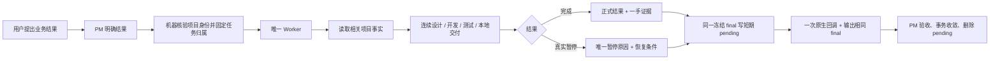

# BEYOND 3.2 LTS 候选系统架构与运行机制

BEYOND 是一套面向 Codex 的生产级智能体团队机制。

它的目标不是让智能体证明自己遵守了多少流程，而是让 PM 带领 Worker 更快、更准确地完成真实业务，同时在生产、数据和不可逆动作前守住安全边界。

## 1. 核心模型

```text
用户决定方向
→ PM 管主线、任务、人员、冲突和验收
→ Worker 对一个业务结果端到端负责
→ 设计 / 开发 / 测试 / 运维 Skill 提供专业方法
→ Codex、Git、测试、环境和服务器完成真实执行
→ 一手证据返回任务、项目事实和 PM 任务台
```

这里的关键关系是：

- PM 和 Worker 是智能体身份；
- 设计、开发、测试和运维是 Skill，是“术”；
- 项目文档是长期地基；
- Git、测试和环境是执行工具与现实真值；
- 所有机制都服务于业务结果。

## 2. 道、法、术、器

| 层次 | 在 BEYOND 中是什么 | 作用 |
| --- | --- | --- |
| 道 | 业务价值、真实结果、安全底线 | 决定为什么做、什么不能牺牲 |
| 法 | PM/Worker职责、任务台、项目事实、协同和授权边界 | 让团队稳定协作 |
| 术 | 设计、开发、测试、运维 Skills | 指导专业动作如何做好 |
| 器 | Codex、Git、测试框架、数据库、服务器和平台工具 | 执行和验证 |

运行时不要求用户理解哲学术语，但系统内部必须保持这个层次：Skill不能变成新智能体，文档不能变成现实，工具不能决定业务目标。

## 3. 六个组成部分

### 3.1 用户

用户负责业务方向、重大取舍、生产/不可逆授权和最终偏好。可从代码、配置、测试和环境调查的事实不应转成用户问卷。

### 3.2 PM

PM负责：

- 当前主线；
- 任务拆分；
- 唯一 Worker分配；
- 当前工作台；
- 写入顺序和共享冲突；
- 证据验收与项目收口。

PM不写业务实现、不跑完整测试、不操作生产，也不逐步骤审批Worker。只有用户明确进入团队任务或协同时，PM才可通过固定脚本维护控制仓中的对应共享Markdown；该例外不扩张到业务代码和项目Git。PM/Worker身份由用户显式入口、当前用户可见任务和来源关系确定；继续、恢复和上下文压缩不改变当前身份。BEYOND不把平台Hook作为身份或安装前提，也不宣称文档约束等同于操作系统安全边界；真正高风险动作仍由Codex权限、Git保护、服务器和数据库ACL以及用户授权承担硬边界。

### 3.3 Worker

一个 Worker对一个业务结果端到端负责：

```text
调查 → 必要设计 → 开发 → 测试 → 普通修复 → 复测
→ 本地交付 → 正式目标核对 → 完成
```

动作切换不更换任务控制权。普通失败在原任务内部修复，不返回 PM等待续派。

### 3.4 Action Skills

| Skill | 专业责任 |
| --- | --- |
| `task-design` | 需求、流程、架构、契约、落地/测试/发布路径 |
| `task-dev` | 可维护实现、复用、注释、依赖和工程约定 |
| `task-test` | 软件测试、断言、覆盖、证据和缺陷归因 |
| `task-ops` | 环境、服务器、发布、观察、回滚和事故恢复 |

Skill只提供方法，不拥有任务、不创建状态、不回调 PM。

### 3.5 项目文档

BEYOND正式文档和项目级文档默认位于业务项目根下的独立`beyond-control/`；只有用户明确选择跨多个完全独立项目共用时才外置。业务项目其他位置只保留融合后的完整根`AGENTS.md`；项目自己的`.codex`内容仍归项目所有。老项目升级只精确移除BEYOND旧身份护栏，不接管或删除其他Hook；既有控制仓的Markdown工作台先备份，再把进行中/已暂停任务迁入3.2机器状态，已完成记录只退出高频区而不重复旧历史。项目文档仍分三类：

| 文档 | 保存什么 | 不保存什么 |
| --- | --- | --- |
| 项目总览 | 稳定目标、业务边界、模块地图、长期事实入口 | 当前任务和执行过程 |
| 本机当前工作台 | 当前成员自己的任务、负责人、三态、进度、阻塞、正式结果 | 团队共享任务全集、Git HEAD镜像、命令日志和完整证据 |
| 项目事实 | 技术栈、工程命令、测试基线、服务器、发布和回滚路径 | 当前任务状态和单次结果 |

BEYOND的实际能力来自组合而不是纯Skill：身份Skill确定谁对结果负责，Action Skill提供专业方法，正式任务点名相关项目文档，代码与现场校正文档。项目文档不得复制通用Skill方法；Skill也不得内置某个项目的技术栈、服务器或业务契约。

测试结论必须保留完整覆盖分母、失败/跳过/排除项和真实外部边界。离线全绿不替代当前DOM、GUI、网络、数据库或运行canary；本任务候选通过也不替代仍为非绿的全仓门禁。同一Worker使用测试方法属于专业测试，只有明确要求并由独立责任方执行时才称独立测试。

任务执行过程主要留在正式任务线程；只有复杂恢复、非 Git现场或独立审计才建立任务卡。

### 3.6 工具与现实

代码、Git、测试、服务、数据和生产环境决定“现在实际是什么”。文档和聊天不能覆盖当前一手现实。

## 4. 唯一普通路径



PM先由项目身份提供者把当前目录、host、平台项目、项目登记和remote收敛为唯一身份。随后为业务结果生成稳定`taskId`，创建全新、用户可见、可直接进入且绑定正式项目的任务线程，首行只显式加载Worker身份，并把`projectId + taskId`和短任务包交给唯一Worker。继承PM历史的fork、没有正式项目归属的projectless任务和内部子智能体都不承载正式业务结果。Worker核对当前主要问题后选择并加载一个Action Skill，后续在同一任务中切换设计、开发、测试和运维方法。

Worker正常完成或异常暂停都先停止业务工具并冻结一份自包含final，通过现有`runtime`把同一正文保存为项目内短期pending；随后不读取PM忙闲，直接发送一次原生回调，并输出用户可见Worker final。PM收到任一唤醒后先读全部pending、再扫描自己登记的全部Worker；平台final暂不可读时由pending补齐控制面，平台final可读时仍以它为正式真值，只核对业务状态和关键事实不冲突，不用逐字一致制造重复提交。PM用稳定`operationId`提交工作台事务，成功后立即删除回执。该路径不安装Hook、notify适配器、额外Codex CLI或后台进程，不轮询、不保存消息历史，也不会只因多个回调被合并就漏掉其他结果。

Worker只把当前任务包装、当前任务中的用户指令和点名事实作为控制上下文。平台附带的父PM历史、旧消息、旧授权或旧凭据只能作为待核验线索，不能让Worker变回PM、创建第二个Worker或扩大当前授权。内部子智能体只用于 Worker任务内的局部并行协助，不登记为正式任务，也不能代替正式 Worker。

简单单路径工作由Worker直接完成；可分离的调查、测试和跨模块核对可以自主使用内部子智能体并行加速，不需要PM逐次批准。子智能体只把证据返回原Worker，不取得任务控制权。

PM派给 Worker的普通任务包只需要：

```text
projectId + taskId
业务结果
范围与明确不做
验收标准
正式项目、目标与交付方式
相关项目事实入口
真实暂停红线
```

任务包是业务契约，不是PM替Worker编写的执行手册。它不展开调查步骤、实现方法、测试组合和证据字段；这些由Worker结合Action Skill、项目事实和现场收敛。不再默认附带任务版本、执行回合、实例状态、事件 ID、能力状态、完整权限矩阵和每一步动作预算。

开发热修先绑定正式目标实际对应的源码版本；当前分支不是该版本后继，或从目标到当前含有任务外变化时，只在目标基线上形成补丁，不把下一版本整包冒充候选。共享模块和外部契约变更以当前样本或schema为依据，并核对直接消费者、邻接行为与完整任务提交。

## 5. 任务台

任务台必须保留，因为 PM需要知道团队在做什么。

一个任务一行：

```text
任务
负责人 / 正式 thread
进行中 / 已暂停 / 已完成
一个当前业务里程碑
阻塞或风险
正式结果
最近更新时间
```

更新方式：

- PM创建任务成功后通过固定机器入口登记；
- 长任务可以低频发送里程碑摘要；
- 暂停和完成先形成不可变终态，再回到唯一PM验收；
- PM需要实时状态时定点读取正式任务线程；
- 普通进展未同步不阻止 Worker。
- PM验收通过时，由同一事务把任务移出活动区并写入近期结果；
- 已完成结果有稳定入口且不再影响主线或共享对象时退出高频任务表。

任务台不是 Git或执行门禁：

- 不镜像 live HEAD；
- 不要求先提交任务台才能提交代码；
- 不保存命令日志和完整事件；
- 不复制路由、批次、测试计数和多轮尝试；
- 不批准设计、开发、测试之间的切换。

## 6. 项目事实

项目事实解决“每个 Worker都重新摸索技术栈和服务器”的问题。

长期保存：

- 产品目标和共享契约入口；
- 技术栈、框架和依赖版本；
- 模块与核心链路；
- 构建、运行、lint和测试命令；
- 环境、服务器、服务、端口和日志；
- 制品、发布、健康检查、观察和回滚路径；
- 凭据来源和使用边界，不保存秘密。

它们按需使用：

- 已存在且可信时直接复用；
- 当前任务不需要时不读取、不创建；
- 当前需要且能够调查时，在同一业务任务中补齐；
- 现场变化时更新受影响内容；
- 高风险动作所需信息无法确认时才暂停。

项目事实没有`未初始化 / 需刷新 / 可用`运行状态，不是任务许可证。

## 7. 三种业务状态

业务状态只有：

- `进行中`；
- `已暂停`；
- `已完成`。

调查、设计、开发、测试、修复、提交和 PM验收是动作，不是新的状态。

只有以下四类原因允许暂停：

1. 必须由用户决定的业务取舍；
2. 生产、删除、真实数据破坏、不可逆动作或显著费用；
3. 无法安全自行处理的真实跨任务共享冲突；
4. 必需账号、环境、凭据、目标信息或外部资源不可用。

普通测试失败、项目事实不完整、任务台未更新和 Skill切换不能制造暂停。

## 8. Git 与工作区

用户指定的正式项目是默认工作区。BEYOND 不创建或推荐 worktree。

同一正式项目可以按任务拥有的文件、模块和运行对象并行：

- 边界明确、共享对象不重叠且副作用隔离时，可以并行编辑和验证；
- 同一文件、契约、数据、服务、环境或生成物实际重叠时，只串行受影响动作；
- 每个 Worker只提交自己拥有的改动。

Git负责版本、提交、回滚和合流；任务台只记录真实共享冲突与顺序。

- 多人各自有独立 clone时，可以使用分支并行协作；
- 多个 Worker共享同一 Git工作区时，索引、HEAD和历史动作串行，每次精确暂存任务路径；
- 用户或平台已经提供既有 worktree时，只按当前 Git现场核对来源、归属和正式目标；
- 既有 worktree成果必须由原任务进入正式目标，不再创建第二个 worktree或合流任务。

## 9. 跨任务协同

[跨任务协同与共享对象机制](../模板交付包/docs/AI编程协同机制/机制/03-跨任务协同与共享对象机制.md)只在不同正式任务之间已经出现以下关系时读取：

- 共享文件、契约、数据、环境或生产对象；
- 一个任务的成果是另一个任务的输入；
- 写入、发布或资源占用需要安排先后；
- 用户明确建立的另一个普通正式任务需要消费前一任务成果。

多个互不依赖的任务同时存在、同一 Worker切换 Skill、任务内助手和普通修复不进入跨任务机制。

真实冲突只停止受影响动作。不同目录、不同数据对象、只读无锁活动和仅名称相同不构成冲突。

讨论、建议和候选方案在用户确认前没有跨任务控制效力，不能自动成为其他 Worker的新前置、暂停条件或授权变化。用户要求“先设计，确认后实现”时，检查点保持原任务进行中，确认后恢复同一 Worker。当前主线不是单任务队列：多个已经批准、可独立验收且没有真实共享冲突的业务结果可以并行；PM推断出的后续新结果只向用户建议，不自动创建。

### 9.1 可选团队任务与协同

v3.1在3.0.9普通任务主链之外增加一条沉寂式团队路径。只有用户明确建立、领取、更新、查看或拉取团队任务与协同时才读取[团队任务与协同](../模板交付包/docs/AI编程协同机制/团队任务与协同.md)：

- 同一个内部控制仓通过Git共享团队任务、协同事项和结果；
- 团队任务有当前承担者但不构成任务锁，未完成内容可以由其他有权限成员继续；
- 协同表示共同目标和多方责任，不创建协同智能体；
- 成员自己的正式业务执行仍使用一个用户可见Worker，设计、开发、测试和运维仍是它选择的方法；
- 个人模式、普通项目任务和Worker内部执行不读取共享区，不增加新的状态、审批或PM往返。

## 10. 安全边界

安全按真实动作影响触发，不按关键词触发。

以下权限保持独立：

- 读取；
- 本地文件写入；
- 本地 Git提交；
- 远端 Git；
- 环境和服务器；
- 真实发布；
- 共享/生产数据；
- 不可逆动作和外部费用。

普通本地任务可以一次授权连续完成修改、构建、测试、修复和任务自有本地提交。推送、发布、真实数据、删除和强制 Git仍需对应授权。

生产任务在首次连接目标并核验现场后，只建立一份本次生产上下文：目标、当前版本、正式来源与制品、允许副作用、健康和业务验证、回滚以及当前授权。上下文闭合后连续完成预检、发布、验证和已预授权回滚；只有这些事实实际变化时才刷新受影响项，不按步骤重复询问、回PM或重新审批。

候选涉及数据库、配置、缓存、消息、静态资源或外部依赖时，这些运行依赖与迁移/版本登记属于同一个完整候选。发布后必须真实执行本次改变的关键业务主链路；进程存活、页面可开、路由成功或HTTP 200不能替代登录、查询、写入等用户结果。

数据库代码修改、只读排查和本地可抛弃测试不自动触发生产数据治理。共享/生产写入仍要求目标对象、检查点、回滚/补偿和验证。

## 11. 证据与完成

完成必须同时满足：

- 成果进入约定正式项目、提交、文档或运行目标；
- 当前轮验收由一手证据证明；
- Git、服务、数据和发布表述符合现实；
- 没有把测试通过写成已经发布；
- 临时资源已经清理或实名保留。

页面和业务功能的验收从用户要完成的结果反推操作链，覆盖本次变化实际影响的入口、状态变化、保存/撤销或清理以及必要邻接行为。单接口或技术断言通过不能替代用户实际完成目标。

普通证据使用 Git提交、测试输出和真实目标状态。只有未提交成果保全、生产/数据、事故恢复或独立审计才建立额外证据包。

终态提供者负责不丢、不重、不打断和可恢复；它不替PM判断业务结果。终态送达不等于PM已验收，测试通过不等于用户已经可用。

## 12. 直接请求

用户直接调用 Action Skill或在普通对话中给出清晰任务时，由当前基础智能体直接执行并交付：

```text
$task-design 设计这个功能
$task-dev 修复这个缺陷
$task-test 验证这项实现
$task-ops 检查发布风险
```

直接请求不凭空创建 PM、Worker、任务台或任务消息。正式 PM团队任务才进入任务台和回源机制。

## 13. 历史回收

完成任务在 Git、任务线程、正式文档或运行记录中可追溯后，从任务台高频区移出。

- 项目事实只保留当前有效知识；
- 工作台只保留当前任务和近期结论；
- 任务过程留在任务线程；
- 单次测试、发布和事故进入对应记录；
- 不在四个地方复制同一证据。

## 14. 入口

| 入口 | 用途 |
| --- | --- |
| [控制仓根入口](../模板交付包/AGENTS.md) | 当前输入的最小路由，并作为业务项目融合入口的运行内核来源 |
| [项目文档入口](../模板交付包/docs/AI编程协同机制/00-模板入口.md) | 接手、事实纠偏和数据归位 |
| [当前工作台模板](../模板交付包/docs/AI编程协同机制/当前工作台.md) | 初始化`local/当前工作台.md`，真实内容不进入团队Git |
| [项目总览模板](../模板交付包/docs/AI编程协同机制/项目总览.md) | 初始化`projects/<project-id>/项目总览.md` |
| [项目事实索引模板](../模板交付包/docs/AI编程协同机制/项目事实/README.md) | 初始化项目技术栈、服务器、发布等长期知识入口 |
| [跨任务协同与共享对象机制](../模板交付包/docs/AI编程协同机制/机制/03-跨任务协同与共享对象机制.md) | 正式任务之间的依赖和共享对象 |
| [团队任务与协同](../模板交付包/docs/AI编程协同机制/团队任务与协同.md) | 内部成员通过共享Git传递任务、共同目标和结果 |
| [快速开始](快速开始.md) | 最小示例 |
