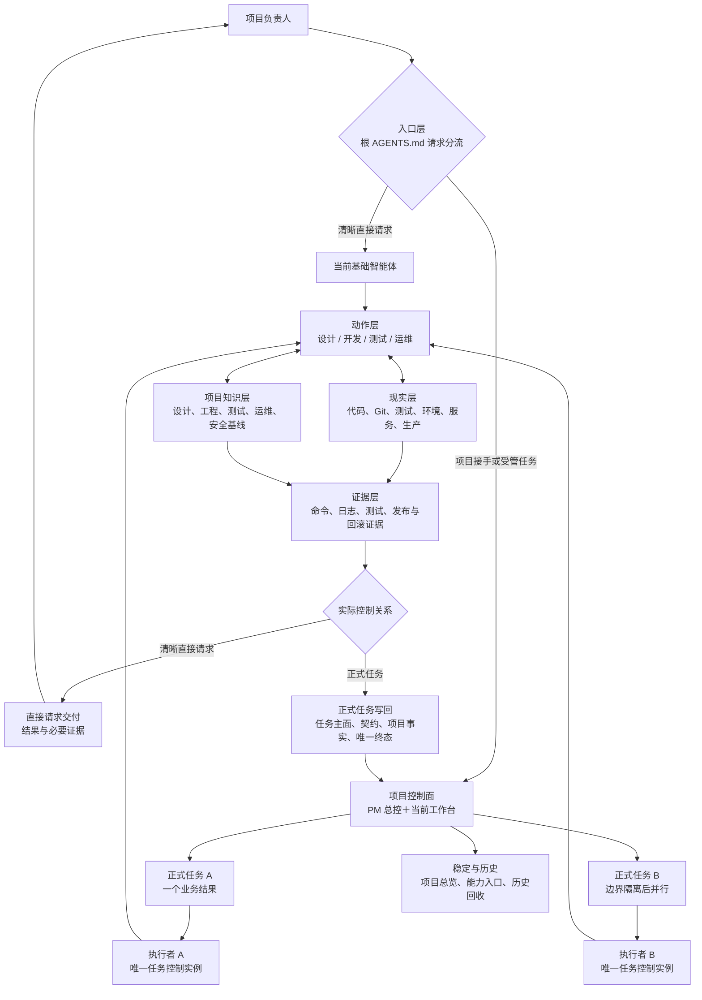
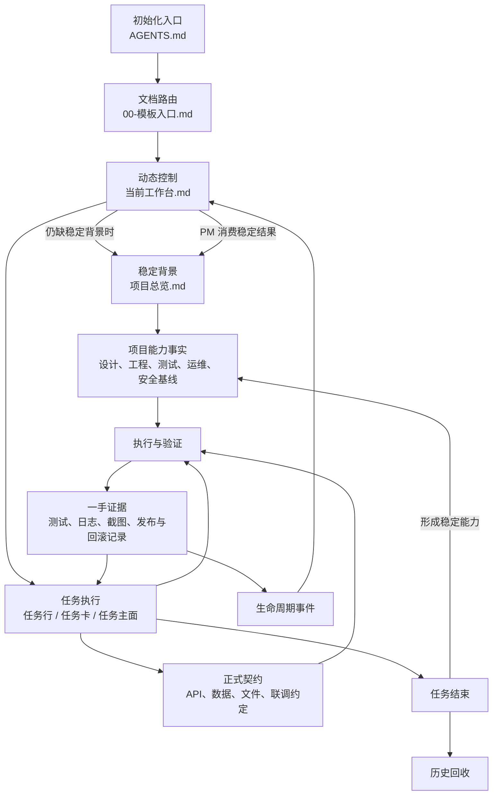
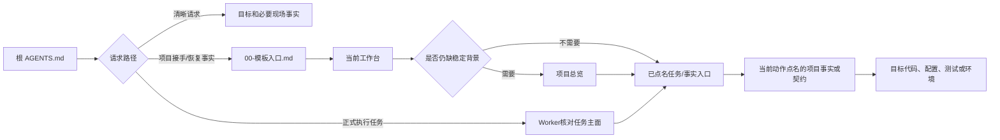
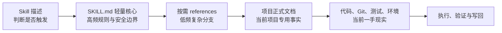
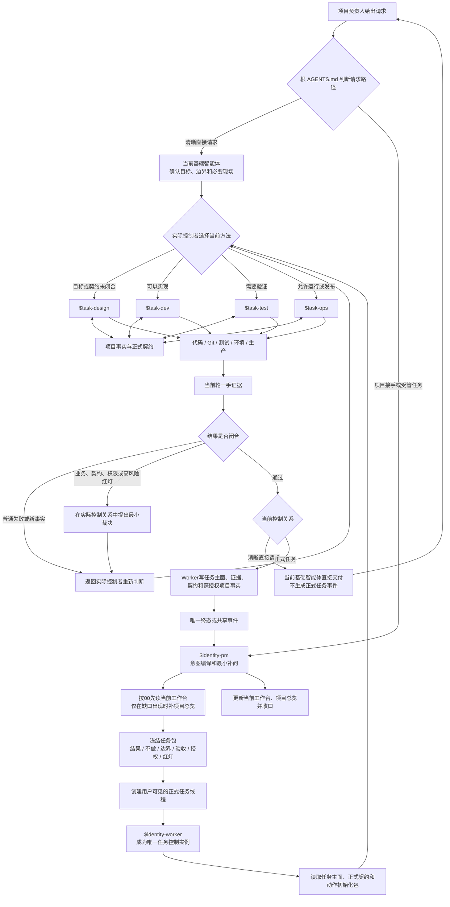
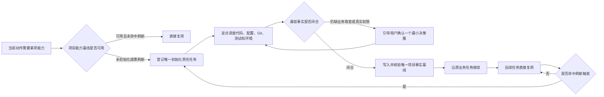
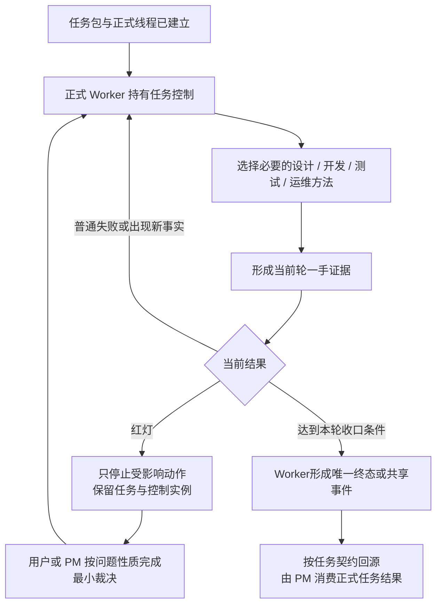
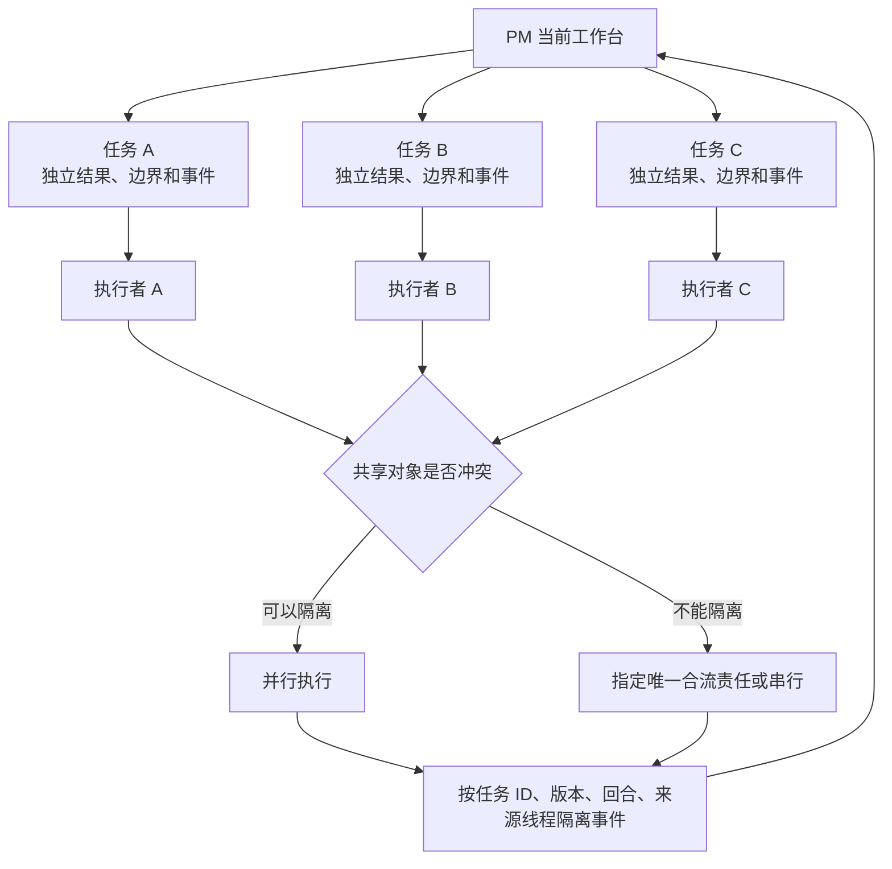

# BEYOND 3.0 系统架构、文档机制与使用说明

> 适用对象：希望评估、使用、维护或贡献 BEYOND 3.0 的读者。
>
> 作用：解释这套系统解决什么问题，文档、Skills、正式任务、真实环境和证据怎样组合运行，以及用户怎样启动和使用。
>
> 边界：本文描述通用产品机制，不保存任何真实项目的服务器、凭据、业务数据、任务 thread ID或动态发布快照。

## 1. 产品定义

BEYOND 3.0 是一套面向 Codex 的文档驱动 AI 工程协同系统。

它不是六个彼此独立的机器人，也不是一组孤立的提示词。它把项目协作拆成五个相互约束的部分：

1. `项目文档`保存目标、授权、状态、契约、项目知识和证据。
2. `身份 Skills`固定谁负责项目控制、谁负责单个任务结果。
3. `动作 Skills`固定设计、开发、测试、运维怎样按专业流程执行。
4. `正式任务线程`承载一个业务结果的完整生命周期和用户纠偏。
5. `代码与真实环境`提供 Git、测试、服务、服务器、数据和生产的一手现实。

系统同时支持两条入口：

```text
清晰直接请求
→ 当前基础智能体选择必要的动作 Skill
→ 直接交付结果，不凭空建立 PM、Worker 或任务事件

项目接手或受管任务
→ PM 形成完整任务包
→ 正式 Worker 连续完成必要动作
→ 普通失败在任务内重新判断、修复和回测
→ 只有真实红灯才打断相关动作
→ 结果、证据和项目知识一起沉淀
```

## 2. 这套系统解决什么问题

### 2.1 上下文容易丢失

新任务只看聊天历史，常常不知道当前主线、允许范围、最新契约和下一步。3.0 使用根入口、项目总览、当前工作台和任务主面建立有层次的最小读入链。

### 2.2 任务下达不完整

用户不需要亲自编写复杂任务卡。PM 先调查可发现事实，再把自然语言编译为业务结果、明确不做、读写边界、动作路径、验收、授权、红灯和收口方式；只对真正改变方向或高风险权限的缺口做最小补问。

### 2.3 多阶段反复等待

设计、开发、测试、运维是动作能力，不是四个等待续派的业务任务。正式任务由同一个 Worker 按当前事实切换动作；普通失败回到 Worker 重新判断，可能继续设计、开发、测试、环境纠偏或停止，不固定跳到某一个 Skill。

### 2.4 项目每次重新摸索

技术栈、代码入口、测试命令、服务器、发布目录和回滚步骤会沉淀为项目能力事实。首次实际需要时初始化，后续直接复用，只刷新变化部分。

### 2.5 多任务容易串线

每个业务结果拥有独立的任务 ID、版本、执行回合、正式任务线程、任务控制实例、读写边界、共享契约、事件和证据入口。能够隔离时并行，不能隔离时由 PM 指定唯一合流责任或改为串行。

### 2.6 完成结论缺少证据

“代码写完”“开发说测试通过”“旧日志显示正常”都不自动构成完成。系统要求当前轮一手证据、完成剖面、唯一终态和可追溯写回。

## 3. 总体运行架构



动作 Skill 是当前基础智能体或正式 Worker 选择的方法，不是独立控制者，也不会自行创建新的 PM、Worker、正式任务或事件关系。

### 3.1 六个运行层

| 层 | 主要对象 | 负责什么 | 不负责什么 |
| --- | --- | --- | --- |
| 入口层 | 根`AGENTS.md`、模板入口 | 判断模式、最小读入、上下文校验和正式入口 | 不保存业务长过程 |
| 项目控制面 | PM、当前工作台 | 主线、授权、多任务、实例、事件消费、红灯和收口 | 不写业务代码，不代替测试和运维 |
| 任务控制面 | 正式任务线程、执行者、任务主面 | 一个业务结果的完整生命周期、纠偏、动作切换和终态 | 不改变跨任务优先级和 PM 已消费快照 |
| 动作层 | 设计、开发、测试、运维 Skills | 提供专业流程、门禁、验证和交接 | 不改变身份、任务 ID或任务控制权 |
| 项目知识层 | 项目总览、项目事实、正式契约 | 保存稳定背景、可复用能力和唯一共享口径 | 不保存当前实例和命令级流水 |
| 现实与证据层 | 代码、Git、测试、环境、生产、一手证据 | 说明当前真实情况，支撑任务裁决 | 不自行定义业务目标和授权 |

## 4. 文档系统怎样工作

文档不是附加说明，而是系统的长期记忆、控制状态和正式真值载体。不同类型的事实必须进入不同文档，避免把稳定背景、当前调度、任务过程和历史证据混在一起。

### 4.1 文档分层



### 4.2 每类文档保存什么

| 文档对象 | 保存内容 | 主要写入者 | 主要消费者 | 时效 |
| --- | --- | --- | --- | --- |
| 根`AGENTS.md` | 根原则、请求分流、规则所有者和全局实践闭环 | 项目维护者 | 所有新任务 | 稳定入口 |
| `00-模板入口.md` | 最小项目文档链、缺失与冲突处理、事实归位、文档创建和回收 | 模板维护者 | 进入项目事实恢复的PM或执行者 | 稳定规则 |
| 项目总览 | 项目定位、业务边界、稳定技术路线、子项目入口和可用能力入口 | PM 消费稳定结果后更新 | PM；需要稳定背景的任务 | 稳定层 |
| 当前工作台 | 当前主线、授权、任务、实例、事件消费和下一步 | PM 单写 | PM、项目接手和任务领取 | 动态控制快照 |
| 任务主面/任务卡 | 当前任务契约、纠偏、动作、证据、完成剖面和事件发送端 | 任务控制实例 | 当前任务、PM 验收 | 任务生命周期 |
| 项目事实 | 产品设计、技术架构、工程、测试、运维和安全能力基线 | 获授权任务控制实例 | 对应动作 Skill和后续任务 | 稳定、按触发刷新 |
| 正式契约 | API、数据、文件、状态机和联调约定的唯一版本 | 任务授权指定责任方 | 开发、测试、协作执行线 | 版本化共享真值 |
| 证据和生产记录 | 命令、日志、测试、截图、发布、验证和回滚一手证据 | 执行者、测试或运维动作 | 任务验收、PM 收口 | 只增或历史化 |
| 历史回收 | 已结束任务、旧过程和旧证据索引 | PM 或任务收口 | 追溯场景 | 不进入默认冷启动 |
| `模板/` | 文档格式和字段骨架 | 模板维护者 | 首次创建项目事实的责任任务 | 不是项目真值 |

### 4.3 最小读入链

系统不要求每个新任务读取全部项目文档。读入按任务场景逐层升级：



固定原则：

- 接手项目先判断主线、边界和下一步，不默认展开历史。
- 清晰局部任务只读目标、必要依赖和验证入口，不强迫全项目初始化。
- 同一任务切换动作时继承任务上下文，只补新动作需要的事实。
- 项目事实和 Skill references 按需读取，不进入每轮冷启动。
- 历史资料只能作为线索，不能覆盖当前任务、代码和现场现实。

### 4.4 文档写回闭环

任务产生变化后不能一律写进当前工作台，也不能只留在聊天里：

| 变化类型 | 正式写回位置 |
| --- | --- |
| 当前主线、授权、任务状态、实例和事件消费 | 当前工作台，由 PM 更新 |
| 当前任务执行、用户纠偏、证据和完成剖面 | 任务主面，由任务控制实例更新 |
| 业务目标、稳定边界和长期项目背景 | 项目总览，由 PM 消费稳定结果后更新 |
| 可跨任务复用的设计、工程、测试、运维和安全事实 | 项目事实文件，由获授权任务控制实例更新 |
| API、数据、文件和联调口径 | 唯一正式契约，由指定责任方更新 |
| 当前轮测试、运行、发布和回滚事实 | 证据或生产记录 |
| 已结束过程 | 历史回收，不继续占用当前工作台 |

### 4.5 写入与消费所有权

文档系统通过单写和事件消费避免多任务互相覆盖：

- PM 单写当前工作台中的总控状态、任务授权、实例登记和事件消费结果。
- 任务控制实例写当前任务主面、任务证据和任务已获授权的项目事实。
- 任务线程中的执行事实可能暂时新于当前工作台；PM 消费事件后再更新总控快照。
- 执行者不能把“已发送事件”直接写成“PM 已消费”。
- PM 不能替执行者伪造代码、测试、生产或任务完成事实。
- 一个共享契约只能有一个正式版本，其他文档只引用，不能各写一份。

## 5. Skills 怎样工作

Skills 是制度入口、身份唤醒、动作路由和执行前置钩子，不是项目知识数据库。

### 5.1 两个身份 Skills

| 身份 | 技术入口 | 控制范围 | 默认写回 |
| --- | --- | --- | --- |
| PM 总控 | `$identity-pm` | 项目主线、任务授权、多任务、实例、红灯、事件消费和收口 | 当前工作台；稳定结果进入项目总览 |
| 执行者 | `$identity-worker` | 一个正式任务的完整生命周期、动作切换、任务内纠偏和唯一终态 | 任务主面、证据、获授权项目事实和事件发送端 |

PM 不是开发者，也不是每个阶段的审批中继。执行者不替 PM 改跨任务优先级，也不把设计、开发、测试或运维动作变成新的身份。

### 5.2 四个动作 Skills

| 动作 | 技术入口 | 主要读取 | 主要产出 |
| --- | --- | --- | --- |
| 设计 | `$task-design` | 任务目标、产品设计与契约基线、技术架构、现有正式契约 | 目标与边界、设计、唯一契约、验收和实施交接 |
| 开发 | `$task-dev` | 正式设计、工程开发基线、技术架构、目标代码和验证入口 | 授权内实现、当前轮自测、开发证据和测试交接 |
| 测试 | `$task-test` | 验收标准、测试基线、待测对象、环境和证据规则 | 通过/不通过/不能判断、一手证据和失败归因 |
| 运维 | `$task-ops` | 运行环境、服务器信息、部署手册、安全索引、候选和回滚锚点 | 预检、发布、健康验证、运行事实或回滚结果 |

### 5.3 Skill 内部加载层级



加载原则：

- Skill 描述只负责触发，不承载完整机制。
- `SKILL.md`保留每次不能丢失的高频流程和安全核心。
- `references`只在复杂场景命中时读取，避免每个任务预读全部低频规则。
- 项目文档提供当前项目的技术栈、契约、测试和运维事实。
- 代码、Git、测试和环境提供现场现实；它们与项目文档冲突时触发纠偏和刷新。

## 6. 文档＋Skills 怎样组合运行



这条链路中各对象的关系是：

1. 文档告诉系统`当前目标、授权、状态和项目事实是什么`。
2. 身份 Skill告诉系统`谁拥有控制权并对结果负责`。
3. 动作 Skill告诉系统`当前专业动作应怎样执行和验证`。
4. 真实系统告诉系统`现在实际上发生了什么`。
5. 证据告诉系统`完成结论是否成立`。
6. 动作结果返回选择它的实际控制者：直接请求回当前基础智能体，正式任务回原 Worker；只有正式任务的终态或共享事件进入 PM 控制面。
7. 写回和事件让`这次结果成为后续任务可复用的输入`。

## 7. 项目能力怎样初始化和成长

模板只提供机制、标准路径和事实格式，不会预装某个项目的技术栈、测试账号、服务器或发布流程。



| 能力 | 标准项目事实 | 最低回答内容 | 后续收益 |
| --- | --- | --- | --- |
| 设计与契约 | 产品设计与契约基线、必要时技术架构 | 产品目标、边界、交互入口、共享契约和验收 | 不再每次重新猜业务口径 |
| 开发 | 工程开发基线、技术架构与核心逻辑 | 技术栈、代码入口、编码约定、依赖、构建、运行、自测和 Git约定 | 直接进入正确目录、命令和编码规则 |
| 测试 | 测试与验收基线 | 测试层级、命令、环境、数据、账号入口、基线失败和证据规则 | 直接复用测试入口，只刷新待测对象和环境 |
| 运维 | 运行环境与服务器信息、部署发布运行手册 | 制品、主机、目录、服务、端口、命令、健康检查、日志和回滚 | 发布不再反复摸索服务器和流程 |
| 安全 | 安全与凭据索引 | 凭据名称、来源、权限、使用边界和轮换入口；不保存秘密值 | 能定位授权来源但不泄露凭据 |
| 文档与事件 | 当前工作台、任务主面、证据区和事件目标 | 谁写什么、事件发给谁、结果进入哪里 | 多任务不串线，完成和纠偏可追溯 |

同一项目能力同时只能有一个初始化责任任务。其他任务消费已经确认的部分或等待共享结果，不重复创建文档、重复调查或重复询问用户。

## 8. 正式任务的概念运行链



本节只解释概念链，不复制精确状态值、事件值或迁移表。请求分流以[根 AGENTS.md](../模板交付包/AGENTS.md)为准；正式 Worker 的执行回合与终态以[执行者主入口](../模板交付包/skills/identity-worker/SKILL.md)为准；PM 的消费与收口以[PM 主入口](../模板交付包/skills/identity-pm/SKILL.md)为准；跨身份公共接口以[03-多智能体协同机制](../模板交付包/docs/AI编程协同机制/机制/03-多智能体协同机制.md)为准。

不是所有任务都机械经过四个动作：

- 只读核对可以直接测试后收口。
- 清晰小修可以直接开发→测试。
- 只要求方案时只走设计。
- 已有可部署候选的发布任务可以直接运维预检→发布→验证。
- 缺少能力基线时，在首次实际需要时初始化，而不是每次冷启动全量读取。

## 9. 多任务与并行开发



每个正式任务必须独立拥有：

- 业务结果和明确不做；
- 任务 ID、版本和执行回合；
- 用户可见正式任务线程和唯一任务控制实例；
- 读写边界、共享契约和最终合流位置；
- 验收、证据入口、事件 ID和来源线程；
- Git、测试、发布和生产授权。

协作子智能体只用于局部调查、独立测试或隔离写入。它沿用原任务 ID，只向任务控制实例交付局部结果，不能冒充正式任务、改变授权或直接收口。

## 10. 真值、冲突与刷新

系统不使用一条粗糙的“所有事实总优先级”，而是区分四种真值轴：

| 真值轴 | 回答的问题 | 主要来源 |
| --- | --- | --- |
| 业务授权真值 | 想做什么、明确不做什么、谁能决定、允许做到哪里 | 用户最新明确目标、当前任务包、唯一正式契约 |
| 运行现实真值 | 代码、Git、测试、服务、环境和生产现在是什么 | 当前现场和一手验证 |
| 控制状态真值 | 哪个任务在运行、实例是谁、事件是否已消费 | 任务主面、平台线程、PM 当前工作台 |
| 稳定项目知识 | 后续任务可以复用什么 | 项目总览和项目事实基线 |

冲突处理原则：

1. 用户目标决定方向，但不能把未验证事实直接变成已完成。
2. 当前任务包和正式契约决定授权内预期行为。
3. 代码、Git、测试、环境和生产决定当前运行现实。
4. 任务主面可能暂时新于 PM 当前工作台；PM 消费事件后更新控制快照。
5. 项目事实与运行现实冲突时先按现实纠偏，再刷新项目事实。
6. 模板、样例、历史和口头摘要不能覆盖当前任务、正式契约和一手现实。

## 11. 绿灯、黄灯和红灯

| 等级 | 典型情况 | 默认行为 |
| --- | --- | --- |
| 绿灯 | 目标、边界、契约和授权内正常推进 | 自动继续，在里程碑写摘要 |
| 黄灯 | 普通构建失败、测试失败、可恢复偏差、边界内替代实现 | 记录并在原任务修复回测，不等待 PM |
| 红灯 | 业务语义或正式契约必须改变、写入越界、真实权限缺失、未授权生产或不可逆操作、多实例冲突、证据矛盾、修复超限 | 只暂停受影响动作，提出一个最小裁决 |

红灯按问题性质分流：

- 普通技术错误不形成红灯，由任务内自愈。
- 资源、实例、跨任务优先级和写入边界重分配交 PM。
- 业务语义、验收偏好、生产授权和不可逆决定在原任务对话直接问用户。
- 红灯不是业务终态，不自动把整个任务改成`已暂停`，也不自动释放正式 Worker；精确状态和恢复动作由身份 Skill 与任务契约裁决。

## 12. 常见使用组合

| 组合 | 场景 | 自动路径 | 结果 |
| --- | --- | --- | --- |
| 当前基础智能体＋动作 Skill | 清晰直接的设计、修改、测试或运维请求 | 确认目标和边界→选择必要方法→直接交付 | 不凭空建立 PM、Worker 或任务事件 |
| PM＋执行者 | 需要正式管理的单一业务任务 | 完整任务包→正式任务→连续执行→唯一终态 | 用户只在任务对话纠偏，不需要逐阶段回 PM |
| PM＋多执行者 | 多个独立需求 | 多正式任务并行→边界和事件隔离→分别收口 | 一个慢任务不阻塞其他任务 |
| 执行者＋设计＋开发＋测试 | 新功能或跨模块改动 | 契约收敛→实现→一手验证→失败修复回测 | 从目标到可验收实现完整闭环 |
| 执行者＋开发＋测试 | 缺陷修复和清晰小改 | 根因定位→最小修复→原失败路径→受影响回归 | 普通失败不反复找 PM |
| 执行者＋测试 | 只读验收或独立复测 | 定点验证→三态裁决→证据写回 | 防止旧日志和开发自述冒充通过 |
| 执行者＋运维 | 发布前检查、发布或恢复 | 事实复用/初始化→授权检查→执行→验证/回滚 | 知道发布什么、到哪里和怎样恢复 |
| 任一动作＋能力成长 | 同一项目长期迭代 | 首次调查写基线→后续复用→按触发刷新 | 项目越用越熟 |

## 13. 怎么使用

### 13.1 启动或接手项目

```text
$identity-pm 以 PM 总控身份接手当前项目。
先按根 AGENTS.md 的最小读入链判断当前主线、边界和下一步。
```

清晰的判断、设计、修改或测试请求会直接处理，不用接手回执代替工作。空白项目才进入项目总览和当前工作台的引导式初始化。

### 13.2 让 PM 下达完整开发任务

```text
$identity-pm
我要实现：<业务结果>。
明确不做：<范围外内容>。
验收：<可判定的完成结果>。
权限：<允许修改、测试、Git、发布等范围>。
请形成完整任务包并创建正式任务线程，由执行者连续完成需要的设计、开发、测试和运维动作。
```

### 13.3 直接完成清晰小改

```text
$task-dev
只修改 <文件或模块>，把 <当前行为> 改成 <目标行为>。
不要修改 <明确不做>，不要执行 Git。
验收：<命令或可判定结果>。
```

这个入口由当前基础智能体直接执行，不凭空建立 Worker。它不要求先接手整个项目或补一行工作台任务，但不等于可以抢占已有任务。只读小改判断仍按目标定点读取；真正首次写入采用本机制的项目时，只核对当前工作台活动任务表中与目标有关的控制实例、任务主面和读写边界，并结合当前平台任务与实际工作区确认没有重叠写入。无冲突时直接完成；目标已经属于活动任务时回到原任务，或由PM协调边界。

### 13.4 只做方案

```text
$task-design 设计 <目标>。
范围是 <边界>，明确不做 <内容>。
请给主链路、模块职责、必要契约和验收，不改文件。
```

### 13.5 只做测试或证据审查

```text
$task-test 验证 <对象或版本> 是否满足 <验收标准>。
允许执行 <命令>，禁止 <副作用>。
请给通过、不通过或不能判断，以及当前轮一手证据。
```

### 13.6 做发布前检查或真实发布

```text
$task-ops
候选版本或制品：<唯一哈希或制品>。
目标环境：<环境>。
授权范围：<只读预检 / 允许部署 / 允许回滚>。
验证入口：<健康检查和业务验证>。
回滚锚点：<版本或制品>。
```

清晰直接请求由当前基础智能体执行运维方法；正式任务仍由原 Worker 选择运维方法并接回结果。没有真实生产授权时，系统最多做到发布前检查，不会把测试通过自动扩大成生产发布。

## 14. 系统明确不会做什么

- 不把 PM 对话里的内部子智能体当成用户可见正式任务。
- 不按设计、开发、测试、运维机械拆成四个业务任务。
- 不为普通失败逐阶段等待 PM 或用户说“继续”。
- 不因为文件授权推导 Git、服务器、生产、数据或不可逆授权。
- 不用历史记录、模板、口头摘要或开发自述替代当前一手证据。
- 不让多个执行线各自维护一份共享契约。
- 不在缺少真实项目事实时猜服务器、发布目录、测试账号或技术约定。
- 不让任务线程在终态后长期等待纯消费回执。
- 不为了提速削弱唯一任务控制、完整安全核心、测试闭环和回滚能力。

## 15. 产品文档与仓库入口

| 入口 | 用途 |
| --- | --- |
| [产品文档索引](README.md) | 面向 GitHub 读者的长期文档地图 |
| [快速开始](快速开始.md) | 使用最小示例完成第一次可复现体验 |
| [根 README](../README.md) | GitHub 产品首页、快速理解和首次使用 |
| [模板交付包 README](../模板交付包/README.md) | 正式模板内容、Skills 入口和文档地图 |
| [模板交付包 AGENTS](../模板交付包/AGENTS.md) | 模板导入真实项目后的 Codex 初始化入口 |
| [项目文档入口](../模板交付包/docs/AI编程协同机制/00-模板入口.md) | 最小文档链、缺失纠偏、数据归位和文档回收 |
| [项目总览模板](../模板交付包/docs/AI编程协同机制/项目总览.md) | 稳定项目背景和能力入口 |
| [当前工作台模板](../模板交付包/docs/AI编程协同机制/当前工作台.md) | 动态控制快照、任务、实例、事件和证据索引 |
| [项目事实索引](../模板交付包/docs/AI编程协同机制/项目事实/README.md) | 项目能力事实的标准实际落点和所有权 |
| [多智能体协同机制](../模板交付包/docs/AI编程协同机制/机制/03-多智能体协同机制.md) | 真实多智能体关系中的共享边界、接力、公共事件和冲突接口 |

本文不硬编码候选哈希、真实项目部署状态和测试事件 ID。当前版本成熟度、测试结果、可部署归档和回滚锚点应以预发布证据及发布记录为准，避免动态事实污染长期架构说明。
